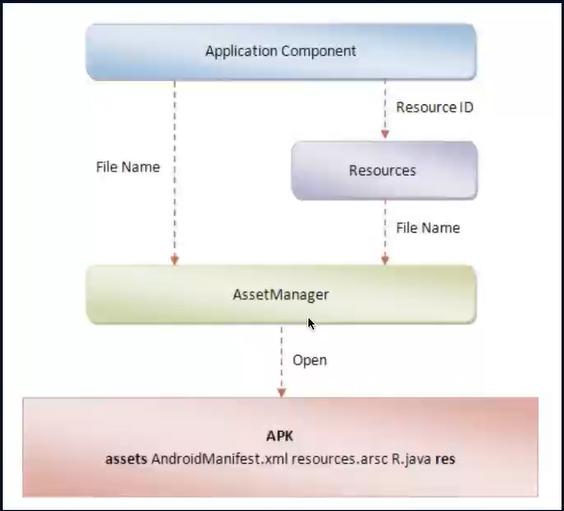

# 换肤目的

插件化换肤 保持APP新鲜感

提高付费率

配合节目 活动进行营销

我们做的车机能否换肤 APP 系统主题切换

换肤框架 不闪烁 无需启动 架构独立

换肤主要是资源文件 图片 字体 图片颜色


插件化换肤的思路

1 指定xml的view怎末解析的 
2 如何拦截系统的创建流程 AppCompatActivity setFactory2 就可以拦截 
那你每一个Activity 都这么做 肯定时不行的啊 --- AOP的思路 lifeCycle

3 拦截后怎么做 重写系统的创建过程代码
4 收集View以及属性 每个Activity的View及属性都要收集  双重循环 循环子View 循环子view的属性
5 创建皮肤包   apk 资源资源代码 加载皮肤包 
6 系统的资源如何加载  (插件化 换肤只需要Res文件) 通过Hook技术
    系统的资源如何加载？ Resources AssetManager
    
    
Resources AssertManager  -> context 
performLaunchActivity - ContextImpl.createBaseContext - new ContextImpl

context.setResource(resourceManager.createBaseTokenResources())
createBaseTokenResources {
    ResourceKey {
        resDir, DisplayID  
    }
    return CreateResource() - FIndOrCreateResource - createResourceImpl(Key) 
            AssManager assets = createAssetManager(key) (从这里可以看到 resource 还是使用assetManager)
    createAssetManager() builder.addApkAsset() loadApkAsset(key.mResDir) 
    AssertManager 加载资源 - 资源路径 - 默认传入的资源路径 key.mResDir(main/res)
                                                    把这个路径改为皮肤包的路径
    Hook的思路 不能改变原有的资源加载, 单独创建一个 AssetManager 专门加载皮肤包的资源  用一个会有资源冲突的问题、
    找反射点 通过反射addAssetPath 方法放入皮肤包的路径  从而得到 加载皮肤包资源的 AssetManager
    设置资源
    String resName = mAppResource.getResourceEntryName(resId) // 获取皮肤包的资源名字
    String resType = mAppResource.getResourceTypeName(resId)  // 通过app的resID 找到类型 layout drawable
    int skinId = mSkinResources.getIdentifier(resName, resType, mSkinPackageName) // 找到皮肤包的ID
```java

import android.app.Application;
import android.content.pm.PackageInfo;
import android.content.pm.PackageManager;
import android.content.res.AssetManager;
import android.content.res.Resources;
import android.text.TextUtils;

import com.enjoy.skin.lib.utils.SkinResources;

import java.lang.reflect.Method;
import java.util.Observable;

public class SkinManager extends Observable {

    private volatile static SkinManager instance;
    /**
     * Activity生命周期回调
     */
    private ApplicationActivityLifecycle skinActivityLifecycle;
    private Application mContext;

    /**
     * 初始化 必须在Application中先进行初始化
     *
     * @param application
     */
    public static void init(Application application) {
        if (instance == null) {
            synchronized (SkinManager.class) {
                if (instance == null) {
                    instance = new SkinManager(application);
                }
            }
        }
    }

    private SkinManager(Application application) {
        mContext = application;
        //共享首选项 用于记录当前使用的皮肤
        SkinPreference.init(application);
        //资源管理类 用于从 app/皮肤 中加载资源
        SkinResources.init(application);
        //注册Activity生命周期,并设置被观察者
        skinActivityLifecycle = new ApplicationActivityLifecycle(this);
        application.registerActivityLifecycleCallbacks(skinActivityLifecycle);
        //加载上次使用保存的皮肤
        loadSkin(SkinPreference.getInstance().getSkin());
    }

    public static SkinManager getInstance() {
        return instance;
    }


    /**
     * 记载皮肤并应用
     *
     * @param skinPath 皮肤路径 如果为空则使用默认皮肤
     */
    public void loadSkin(String skinPath) {
        if (TextUtils.isEmpty(skinPath)) {
            //还原默认皮肤
            SkinPreference.getInstance().reset();
            SkinResources.getInstance().reset();
        } else {
            try {
                //宿主app的 resources;
                Resources appResource = mContext.getResources();
//
                //反射创建AssetManager 与 Resource
                AssetManager assetManager = AssetManager.class.newInstance();
                //资源路径设置 目录或压缩包
                Method addAssetPath = assetManager.getClass().getMethod("addAssetPath",
                        String.class);
                addAssetPath.invoke(assetManager, skinPath);

                //根据当前的设备显示器信息 与 配置(横竖屏、语言等) 创建Resources
                Resources skinResource = new Resources(assetManager, appResource.getDisplayMetrics
                        (), appResource.getConfiguration());

                //获取外部Apk(皮肤包) 包名
                PackageManager mPm = mContext.getPackageManager();
                PackageInfo info = mPm.getPackageArchiveInfo(skinPath, PackageManager
                        .GET_ACTIVITIES);
                String packageName = info.packageName;
                SkinResources.getInstance().applySkin(skinResource, packageName);

                //记录
                SkinPreference.getInstance().setSkin(skinPath);


            } catch (Exception e) {
                e.printStackTrace();
            }
        }
        //通知采集的View 更新皮肤
        //被观察者改变 通知所有观察者
        setChanged();
        notifyObservers(null);
    }

}

```

替换组件
```java


import android.graphics.drawable.ColorDrawable;
import android.graphics.drawable.Drawable;
import android.support.v4.view.ViewCompat;
import android.util.AttributeSet;
import android.view.View;
import android.widget.ImageView;
import android.widget.TextView;

import com.enjoy.skin.lib.utils.SkinResources;
import com.enjoy.skin.lib.utils.SkinThemeUtils;

import java.util.ArrayList;
import java.util.List;

/**
 * 这里面放了所有要换肤的view所对应的属性
 */
public class SkinAttribute {
    private static final List<String> mAttributes = new ArrayList<>();
    static {
        mAttributes.add("background");
        mAttributes.add("src");
        mAttributes.add("textColor");
        mAttributes.add("drawableLeft");
        mAttributes.add("drawableTop");
        mAttributes.add("drawableRight");
        mAttributes.add("drawableBottom");
    }

    //记录换肤需要操作的View与属性信息
    private List<SkinView> mSkinViews = new ArrayList<>();


    //记录下一个VIEW身上哪几个属性需要换肤textColor/src
    public void look(View view, AttributeSet attrs) {
        List<SkinPair> mSkinPars = new ArrayList<>();

        for (int i = 0; i < attrs.getAttributeCount(); i++) {
            //获得属性名  textColor/background
            String attributeName = attrs.getAttributeName(i);
            if (mAttributes.contains(attributeName)) {
                // #
                // ?722727272
                // @722727272
                String attributeValue = attrs.getAttributeValue(i);
                // 比如color 以#开头表示写死的颜色 不可用于换肤
                if (attributeValue.startsWith("#")) {
                    continue;
                }
                int resId;
                // 以 ？开头的表示使用 属性
                if (attributeValue.startsWith("?")) {
                    int attrId = Integer.parseInt(attributeValue.substring(1));
                    resId = SkinThemeUtils.getResId(view.getContext(), new int[]{attrId})[0];
                } else {
                    // 正常以 @ 开头
                    resId = Integer.parseInt(attributeValue.substring(1));
                }

                SkinPair skinPair = new SkinPair(attributeName, resId);
                mSkinPars.add(skinPair);
            }
        }

        if (!mSkinPars.isEmpty() || view instanceof SkinViewSupport) {
            SkinView skinView = new SkinView(view, mSkinPars);
            // 如果选择过皮肤 ，调用 一次 applySkin 加载皮肤的资源
            skinView.applySkin();
            mSkinViews.add(skinView);
        }
    }


    /*
       对所有的view中的所有的属性进行皮肤修改
     */
    public void applySkin() {
        for (SkinView mSkinView : mSkinViews) {
            mSkinView.applySkin();
        }
    }

    static class SkinView {
        View view;
        //这个View的能被 换肤的属性与它对应的id 集合
        List<SkinPair> skinPairs;

        public SkinView(View view, List<SkinPair> skinPairs) {
            this.view = view;
            this.skinPairs = skinPairs;

        }
        /**
         * 对一个View中的所有的属性进行修改
         */
        public void applySkin() {
            applySkinSupport();
            for (SkinPair skinPair : skinPairs) {
                Drawable left = null, top = null, right = null, bottom = null;
                switch (skinPair.attributeName) {
                    case "background":
                        Object background = SkinResources.getInstance().getBackground(skinPair
                                .resId);
                        //背景可能是 @color 也可能是 @drawable
                        if (background instanceof Integer) {
                            view.setBackgroundColor((int) background);
                        } else {
                            ViewCompat.setBackground(view, (Drawable) background);
                        }
                        break;
                    case "src":
                        background = SkinResources.getInstance().getBackground(skinPair
                                .resId);
                        if (background instanceof Integer) {
                            ((ImageView) view).setImageDrawable(new ColorDrawable((Integer)
                                    background));
                        } else {
                            ((ImageView) view).setImageDrawable((Drawable) background);
                        }
                        break;
                    case "textColor":
                        ((TextView) view).setTextColor(SkinResources.getInstance().getColorStateList
                                (skinPair.resId));
                        break;
                    case "drawableLeft":
                        left = SkinResources.getInstance().getDrawable(skinPair.resId);
                        break;
                    case "drawableTop":
                        top = SkinResources.getInstance().getDrawable(skinPair.resId);
                        break;
                    case "drawableRight":
                        right = SkinResources.getInstance().getDrawable(skinPair.resId);
                        break;
                    case "drawableBottom":
                        bottom = SkinResources.getInstance().getDrawable(skinPair.resId);
                        break;
                    default:
                        break;
                }
                if (null != left || null != right || null != top || null != bottom) {
                    ((TextView) view).setCompoundDrawablesWithIntrinsicBounds(left, top, right,
                            bottom);
                }
            }
        }
        private void applySkinSupport() {
            if (view instanceof SkinViewSupport) {
                ((SkinViewSupport) view).applySkin();
            }
        }
    }

    static class SkinPair {
        //属性名
        String attributeName;
        //对应的资源id
        int resId;

        public SkinPair(String attributeName, int resId) {
            this.attributeName = attributeName;
            this.resId = resId;
        }
    }
}

```

创建一个Resources AssetManager 专门加载皮肤包 
Hook 技术 反射 动态代理的使用 通过反射 动态代理等技术 改变代码的原来逻辑

// 必须在 super.onCreate()调用  
LayoutInflater.form(this).setFactory2(new LayoutInflater.Factory2 () { public View onCreateView(View parent, String
name, Context context) { if (TextUtils.equals(name, "TextView")) { Button button = new Button(context); return button; }
return null; }

    public View onCreateView(String name, Context context, AttributeSet aset { 
        return null;    
    }

})
