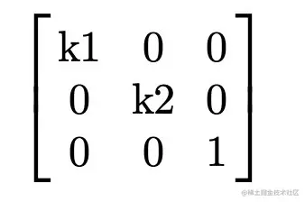
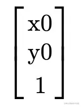
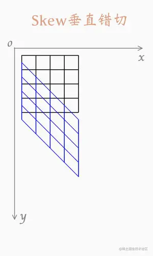
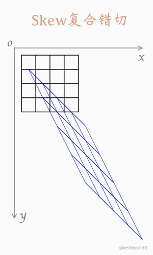
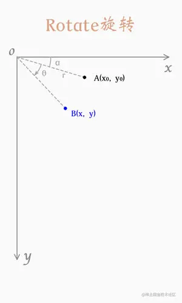
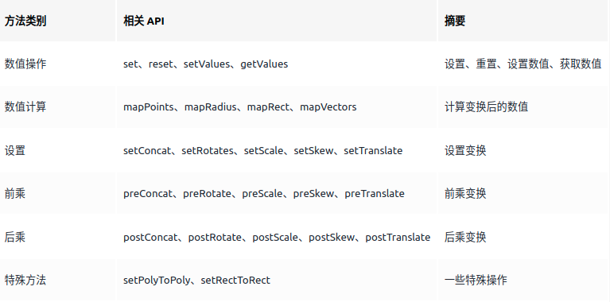
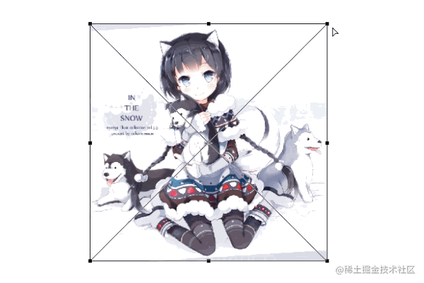

## Android 图形处理 —— Matrix 原理剖析

### Matrix 简介

Android 图形库中的 android.graphics.Matrix 是一个 3×3 的 float 矩阵，其主要作用是坐标变换

它的结构大概是这样的

其中每个位置的数值作用和其名称所代表的的含义是一一对应的

MSCALE_X、MSCALE_Y：控制缩放
MTRANS_X、MTRANS_Y：控制平移
MSKEW_X、MSKEW_X：控制错切
MSCALE_X、MSCALE_Y、MSKEW_X、MSKEW_X：控制旋转
MPERSP_0、MPERSP_1、MPERSP_2：控制透视

在 Android 中，我们直接实例化一个 Matrix，内部的矩阵长这样：

matrix_3

是一个左上到右下为 1，其余为 0 的矩阵，也叫单位矩阵，一般数学上表示为 I

Matrix 坐标变换原理

前面说到 Matirx 主要的作用就是处理坐标的变换，而坐标的基本变换有：平移、缩放、旋转和错切

这里所说的基本变换，也称仿射变换 ，透视不属于仿射变化，关于透视相关的内容不在本文的范围内

当矩阵的最后一行是 0,0,1 代表该矩阵是仿射矩阵，下文中所有的矩阵默认都是仿射矩阵

## 线性代数中的矩阵乘法

在正式介绍 Matrix 是如何控制坐标变换的原理之前，我们先简单复习一下线性代数中的矩阵乘法，详细的讲解可参见维基百科或者翻翻大学的《线性代数》，这里只做最简单的介绍

两个矩阵相乘，前提是第一个矩阵的列数等于第二个矩阵的行数

若 A 为 m × n 的矩阵，B 为 n × p 的矩阵，则他们的乘积 AB 会是一个 m × p 的矩阵，表达可以写为

由定义计算，AB 中任意一点（a,b）的值为 A 中第 a 行的数和 B 中第 b 列的数的乘积的和

了解矩阵乘法的基本方法之后，我们还需要记住几个性质，对后续的分析有用

1. 满足结合律，即 A(BC) = (AB)C
2. 满足分配律，即 A(B + C) = AB + AC  / (A + B)C = AC + BC
3. 不满足交换律，即 AB != BA
4. 单位矩阵 I 与任意矩阵相乘，等于矩阵本身，即 IA = A，BI = B

## 缩放（Scale）

我们先想想，让我们实现把一个点 (x0, y0) 的 x 轴和 y 轴分别缩放 k1 和 k2 倍，我们会怎么做，很简单

val x = k1 * x0
val y = k2 * y0

那如果用矩阵怎么实现呢，前面我们讲到 Matrix 中 MSCALE_X、MSCALE_Y 是用来控制缩放的，
我们在这里填分别设置为 k1 和 k2，看起来是这样的

而点 (x0, y0) 用矩阵表示是这样的

有些人会疑问，最后一行这里不是还有一个 1 吗，这是使用了齐次坐标系的缘故，
在数学中我们的点和向量都是这样表示的 (x, y)，两者看起来一样，计算机无法区分，
为了让计算机也可以区分它们，增加了一个标志位，即

(x, y, 1) -> 点
(x, y, 0) -> 向量

现在 Matrix 和点都可以用矩阵表示了，接下来我们看看怎么通过这两个矩阵得到一个缩放之后的点 
(x, y). 前面我们已经介绍过矩阵的乘法，让我们看看把上面两个矩阵相乘会得到什么结果

可以看到，矩阵相乘得到了一个（k1x0, k2y0,1）的矩阵，上面说过，计算机中，这个矩阵就代表点 (k1x0, k2y0)， 
而这个点刚好就是我们要的缩放之后的点

以上所有过程用代码来实现，看起来就是像下面这样

val xy = FloatArray(x0, y0)
Matrix().apply {
setScale(k1, k2)   
mapPoints(xy)
}

## 平移（Translate）

平移和缩放也是类似的，实现平移，我们一般可写为

val x = x0 + deltaX
val y = y0 + deltaY

而用矩阵来实现则是

val xy = FloatArray(x0, y0)
Matrix().apply {
setTranslate(k1, k2)   
mapPoints(xy)
}

换成数学表示

根据矩阵乘法

x = 1 × x0 + 0 × y0 + deltaX × 1 = x0 + deltaX
y = 0 × x0 + 1 × y0 + deltaY × 1 = y0 + deltaY

可得和一开始的实现也是效果一致的

错切（Skew）

错切相对于平移和缩放，可能大部分人对这个名词比较陌生，直接看三张图大家可能会比较直观

水平错切

x = x0 + ky0
y = y0

矩阵表示

垂直错切

x = x0
y = kx0 + y0
复制代码
矩阵表示

复合错切

x = x0 + k1y0
y = k2x0 + y0

矩阵表示

旋转（Rotate）

旋转相对以上三种变化又有一点复杂，这里涉及一些三角函数的计算，忘记的可以去维基百科 先复习下

同样我们先自己实现一下旋转，假设一个点 A(x0, y0), 距离原点的距离为 r，与水平夹角为 α，现绕原点顺时针旋转 θ 度，旋转之后的点为 B(x, y)

用矩阵表示

Matrix 复合操作原理

前面介绍了四种基本变换，如果我们需要同时应用上多种变化，比如先绕原点顺时针旋转 90° 再 x 轴平移 100，y 轴平移 100， 
最后 x、y 轴缩放0.5 倍，那么就需要用到复合操作

还是先用自己的实现来实现一下

x = ((x0 · cosθ - y0 · sinθ) + 100) · 0.5
y = ((y0 · cosθ + x0 · sinθ) + 100) · 0.5

矩阵表示

按照前面的方式逐个推导，最终也能得到和上述一样的结果

到此，我们可以对 Matrix 做出一个基本的认识：Matrix 基于矩阵计算的原理，解决了计算机中坐标映射和变化的问题

## Android 图形处理 —— Matirx 方法详解及应用场景

数值操作

void set(Matrix src)

深拷贝一份 src 中的数据到当前 Matrix 中, 如果 src 为 null, 则相当于 reset

void reset()

将当前 Matrix 重置成一个单位矩阵

void setValues(float[] values)

将一组浮点数值的前 9 位数据拷贝到 Matrix 中，如果数组长度小于 9，调用该方法会抛出异常

void getValues(float[] values)

从 Matrix 中拷贝数据到 values 浮点数组中

数值计算

void mapPoints(float[] dst, float[] src)
把当前 Matrix 应用到 src 所指示的所有坐标上，然后将变换后的坐标复制到 dst 数组上
数组中每两个相邻的点表示一个坐标（x,y），因此数组长度一般都是偶数，否则最后一个数值不参与计算

float mapRadius(float radius)
把当前 Matrix 应用到半径为 radius 所指示的圆上，然后返回变换之后的圆的半径，由于圆可能会因为画布变换变成椭圆，所以此处测量的是平均半径

boolean mapRect(RectF dst, RectF src)
和 mapPoints 类似，把当前 Matrix 应用到 src 所指示的四个顶点上，然后将变换后的四个顶点值写入 dst 中，返回值是判断矩形经过变换后是否仍为矩形

设置
setRotates、setScale、setSkew、setTranslate
这几个方法比较好理解，就是将变换设置给当前 Matrix，得到一个变换后的 Matrix

boolean setConcat(Matrix a, Matrix b)
相当于计算两个矩阵相乘 a × b，并将结果赋值给当前矩阵，即 c.setConcat(a, b) 表示 c = a × b

前乘后乘
这两类计算也比较好理解，就是对应了数学中的矩阵前乘和后乘

特殊方法
boolean setPolyToPoly
boolean setPolyToPoly (
float[] src, 	// 原始顶点数组 src [x, y]
int srcIndex, 	// 原始顶点数组开始位置
float[] dst, 	// 目标顶点数组 dst [x, y]
int dstIndex, 	// 目标顶点数组开始位置
int pointCount)	// 测控顶点的数量 取值范围是: 0 到 4

Poly 全称是 Polygon，多边形的意思。
调用这个方法后，会计算从原始顶点和到目标顶点的变换（意味着 src 和 dst 要一一对应），把这种变换信息存储到当前 Matrix 中；将得到 的 Matrix 应用到任意图形上，可以实现把这个图形进行 Matrix 所表示的形状变换，效果如下图所示

Matrix 在 Android 中的使用场景

其实我们日常开发中或多或少已经接触了 Matrix，只是大部分我们都还不知道，比如我们使用的 ImageView 的 ScaleType，
实际上内部就是通过 Matrix 实现的

Matrix常用的方法：

（一）变换方法：

     Matrix提供了translate(平移)、rotate(旋转)、scale(缩放)、skew(倾斜)四种操作，这四种操作的内部实现过程都是通过matrix.setValues(…)来设置矩阵的值来达到变换图片的效果。
     Matrix的每种操作都有set、pre、post三种操作，set是清空队列再添加，pre是在队列最前面插入，post是在队列最后面插入。
     pre方法表示矩阵前乘，例如：变换矩阵为A，原始矩阵为B，pre方法的含义即是A*B
     post方法表示矩阵后乘，例如：变换矩阵为A，原始矩阵为B，post方法的含义即是B*A

1.matrix.preScale(0.5f, 1);   
2.matrix.preTranslate(10, 0);  
3.matrix.postScale(0.7f, 1);    
4.matrix.postTranslate(15, 0);  
等价于：
translate(10, 0) -> scale(0.5f, 1) -> scale(0.7f, 1) -> translate(15, 0)
注意：后调用的pre操作先执行，而后调用的post操作则后执行。

set方法一旦调用即会清空之前matrix中的所有变换，例如：
1.matrix.preScale(0.5f, 1);   
2.matrix.setScale(1, 0.6f);   
3.matrix.postScale(0.7f, 1);   
4.matrix.preTranslate(15, 0);  
等价于
translate(15, 0) -> scale(1, 0.6f) ->  scale(0.7f, 1)

matrix.preScale (0.5f, 1)将不起作用。

（二）映射方法

    Matrix提供了mapXXX的方法，用于获取经matrix映射之后的值。主要有：mapPoints，mapRects，mapVectors等方法。
    这些方法你会使用到：在你需要记住matrix操作之后的数值的时候。比如：记住矩形旋转34°（rotate）之后四个点的坐标。（你可以尝试着自己计算，你会发现很复杂，还不精确）

需要注意的是，matrix的某些方法使用到中心点的时候，如果不设置，默认是以（0，0）为中心点的。

记下来，以免忘记。
