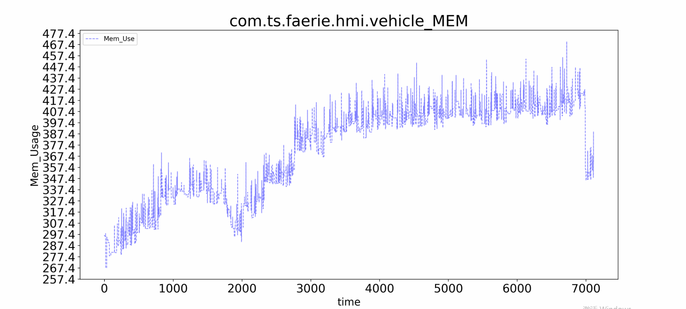

# 内存泄露问题分析

## 问题描述

长时间前台运行车辆设置，存在内存泄漏情况（com.ts.faerie.hmi.vehicle_MEM），具体情况如下：

1.电源上电，车机正常启动

2.运行monkey程序13h

3.绘制内存占用曲线图



应该一波优化后，发现HardKeyManager存在泄漏问题，Leak 分析如下


内存泄露问题代码如下(已经去除关键信息)

```java

package com.ts.car.hardkeytest2;


public class MainActivity extends AppCompatActivity {

    private static final String TAG = "TestActivity";
    private platFormHardKeyManager mHardKeyManager;

    @Override
    protected void onCreate(Bundle savedInstanceState) {
        super.onCreate(savedInstanceState);
        // MyApplication.getsRefWatcher().watch(this);
        setContentView(R.layout.activity_main);
        mHardKeyManager = new platFormHardKeyManager(this);
        mHardKeyManager.addKeyEventListener(mxxListener, scnenType);
        mHardKeyManager.addKeyEventListener(mxxListener, scnenType);
    }
    

    public IKeyEventListener mxxListener = new IKeyEventListener() {
        @Override
        public void onKeyEvent(KeyEvent keyEvent, int i, int i1) {
            LogUtil.logD(TAG, "mSceneCallback: code = "
                    + keyEvent.getKeyCode() + ", scene = " + i);
        }
    };

    @Override
    protected void onDestroy() {
        super.onDestroy();
        try {
            if (mHardKeyManager != null) {
                mHardKeyManager.removeKeyEventListener(mxxListener, scnenType);
                mHardKeyManager.removeKeyEventListener(mxxListener, scnenType);
                mHardKeyManager.unregisterConnectionListener(this);
            }
        } catch (RemoteException exception) {
            exception.printStackTrace();
        }
    }
}
```
```java
public class PlatformHardKeyManager {
    
    private List<KeyEventListener> mKeyListeners;
    private List<KeyLongPressEventListener> mLongPressListeners;

    @PlatformConstruction
    public PlatformHardKeyManager(Context context) {
        super(context);
        Log.d(TAG, "PlatformHardKeyManager Started.");
        mKeyListeners = new ArrayList<>();
        mLongPressListeners = new ArrayList<>();
    }
    
    @Override
    public boolean addKeyEventListener(IKeyEventListener listener, int sceneType) {
        if (listener == null || sceneType <= 0) {
            return false;
        }
        KeyEventListener eventListener = findKeyEventListener(listener, sceneType);
        if (eventListener != null) {
            return false;
        }
        eventListener = new KeyEventListener(listener, sceneType);
        mKeyListeners.add(eventListener);
        return true;
    }

    private KeyEventListener findKeyEventListener(IKeyEventListener listener, int sceneType) {
        synchronized (this) {
            for (KeyEventListener l : mKeyListeners) {
                if (l.mListener == listener && l.mSceneType == sceneType) {
                    return l;
                }
            }
        }
        return null;
    }

    @Override
    public boolean removeKeyEventListener(IKeyEventListener listener, int sceneType) {
        if (listener == null || mService == null) {
            return false;
        }
        List<KeyEventListener> findListeners = new ArrayList<>();
        synchronized (this) {
            for (KeyEventListener l : mKeyListeners) {
                if (l.mListener == listener) {
                    if (sceneType == -1 || l.mSceneType == sceneType) {
                        findListeners.add(l);
                    }
                }
            }
            for (KeyEventListener l : findListeners) {
                mKeyListeners.remove(l);
            }
        }
        return true;
    }
    //////////////////////////////////////////////////////////////////////////////////////
    static class KeyEventListener {

        IKeyEventListener mListener;
        int mSceneType;

        public KeyEventListener(IKeyEventListener listener, int sceneType) {
            mListener = listener;
            mSceneType = sceneType;
        }

        @Override
        public void onKeyEvent(KeyEvent event, int sceneType, int targetDisplay) {
            mListener.onKeyEvent(event, sceneType, targetDisplay);
        }

        @Override
        public void onKeyLongPress(KeyEvent event, int sceneType, int targetDisplay) {
            //never happened.
        }
    }
}

```

> 如上就是所有的场景信息， 那末就开始分析上述代码为什么会产生内存泄露并解决它


## 什么是内存泄露

先来看看官方的解释：

> A memory leak is a programming error that causes an application to keep a reference to an object that is no longer needed. 
> Somewhere in the code, there’s a reference that should have been cleared and wasn’t. 

**There are 4 main types of GC root:**

1. Local variables, which belong to the stack of a thread.

2. Instances of active Java threads.

3. System Classes, which never unload.

4. Native references, which are controlled by native code.


https://cloud.tencent.com/developer/article/1947236


加系统签名
java -Djava.library.path=out/host/linux-x86/lib64 -jar out/host/linux-x86/framework/signapk.jar build/make/target/product/security/platform.x509.pem build/make/target/product/security/platform.pk8 app-debug.apk hardkeyTest.apk


GC Root 

