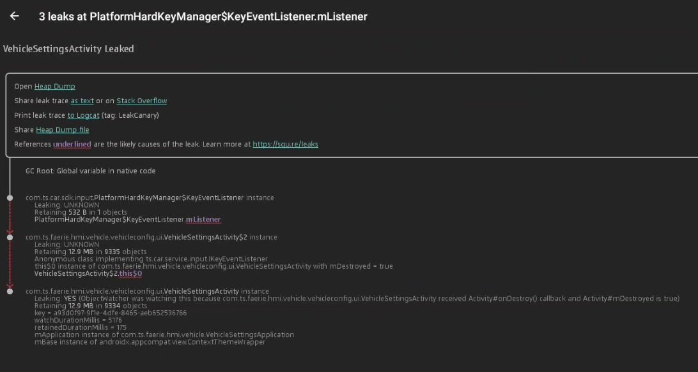

# 内存泄露问题分析

## 一 问题描述

长时间前台运行车辆设置，存在内存泄漏情况（com.ts.faerie.hmi.vehicle_MEM），具体情况如下：

1.电源上电，车机正常启动

2.运行monkey程序13h

3.绘制内存占用曲线图


可以看到，在monkey测试中，我们的内存是一致上升的状态，显然的发生了内存泄露，如果monkey的事件足够长，可能会导致OOM，导致车机崩溃的风险，这显然是不被允许的，
一波优化后，发现HardKeyManager还是存在泄漏问题，Leak Canary的 分析如下：




有了如上信息我们就可以找到 内存泄露问题代码如下(已经去除关键信息)

```java

package com.ts.car.hardkeytest2;

public class MainActivity extends AppCompatActivity {  // class类加载的时候放在方法区

    private static final String TAG = "TestActivity";  // 类加载的时候放在方法区中静态常量池中的对象
    
    private platFormHardKeyManager mHardKeyManager; // 类初始化的时候为null，未创建对象

    @Override
    protected void onCreate(Bundle savedInstanceState) {
        super.onCreate(savedInstanceState); // android 源码，不会发生内存泄露，不再分析其内存结构
        setContentView(R.layout.activity_main); // android 源码，不会发生内存泄露，不再分析其内存结构
        mHardKeyManager = new platFormHardKeyManager(this); // HardKeyManager 对象放在堆区，持有Activity的Context引用
        mHardKeyManager.addKeyEventListener(mxxListener, scnenType_1); // HardKeyManager 内部持有IKeyEventListener的引用
        mHardKeyManager.addKeyEventListener(mxxListener, scnenType_2);
    }
    

    public IKeyEventListener mxxListener = new IKeyEventListener() {
        // MainActivity类创建的时候初始化，创建 IKeyEventListener对象，堆中分配 ，内部类持有 MainActivity的引用，MainActivity 堆中分配 
        @Override
        public void onKeyEvent(KeyEvent keyEvent, int i, int i1) {
            LogUtil.logD(TAG, "mSceneCallback: code = "
                    + keyEvent.getKeyCode() + ", scene = " + i);
        }
    };

    @Override
    protected void onDestroy() {
        super.onDestroy(); // android 源码，不会发生内存泄露，不再分析其内存结构
        try {
            if (mHardKeyManager != null) {
                mHardKeyManager.removeKeyEventListener(mxxListener, scnenType_1);
                mHardKeyManager.removeKeyEventListener(mxxListener, scnenType_2);
                mHardKeyManager.unregisterConnectionListener(this);
            }
        } catch (RemoteException exception) {
            exception.printStackTrace();
        }
    }
}
```
```java
public class PlatformHardKeyManager {

    private List<KeyEventListener> mKeyListeners; // 类加载的时候，引用初始化为null， 未创建对象

    @PlatformConstruction
    public PlatformHardKeyManager(Context context) {
        super(context);
        Log.d(TAG, "PlatformHardKeyManager Started.");
        mKeyListeners = new ArrayList<>();
        // PlatformHardKeyManager初始化的时候创建， 指向一个空数组没分配任何内存空间。真正分配内存是第一次插入数据时  如果是第一次插入后扩容大小为10，
        // private static final Object[] DEFAULT_CAPACITY_EMPTY_ELEMENT_DATA = {};  
        // public ArrayList() {
        // this.elementData = DEFAULT_CAPACITY_EMPTY_ELEMENT_DATA;
        // }
    }

    @Override
    public boolean addKeyEventListener(IKeyEventListener listener, int sceneType) {
        // 在addKeyEventListener方法栈帧中持有IKeyEventListener对象的引用 IKeyEventListener对象 GC Root可达
        if (listener == null || sceneType <= 0) {
            return false;
        }
        KeyEventListener eventListener = findKeyEventListener(listener, sceneType);
        if (eventListener != null) {
            return false;
        }
        eventListener = new KeyEventListener(listener, sceneType);
        // 在addKeyEventListener方法栈帧中创建对象 KeyEventListener， KeyEventListener内部持有IKeyEventListener的引用
        mKeyListeners.add(eventListener); // KeyListeners数组内部持有KeyEventListener的引用
        return true;
    }

    private KeyEventListener findKeyEventListener(IKeyEventListener listener, int sceneType) {
        synchronized (this) {
            for (KeyEventListener l : mKeyListeners) {
                if (l.mListener == listener && l.mSceneType == sceneType) {
                    return l;
                }
            }
        }
        return null;
    }

    @Override
    public boolean removeKeyEventListener(IKeyEventListener listener, int sceneType) {
        if (listener == null || mService == null) {
            return false;
        }
        List<KeyEventListener> findListeners = new ArrayList<>(); // 初始化一个空数组
        synchronized (this) {
            for (KeyEventListener l : mKeyListeners) {
                if (l.mListener == listener) {
                    if (sceneType == -1 || l.mSceneType == sceneType) {
                        findListeners.add(l);
                    }
                }
            }
            for (KeyEventListener l : findListeners) {
                mKeyListeners.remove(l);
            }
        }
        return true;
    }
    //////////////////////////////////////////////////////////////////////////////////////
    static class KeyEventListener { // 

        IKeyEventListener mListener;
        int mSceneType;

        public KeyEventListener(IKeyEventListener listener, int sceneType) {
            mListener = listener; // 发生内存泄露的引用
            mSceneType = sceneType;
        }

        @Override
        public void onKeyEvent(KeyEvent event, int sceneType, int targetDisplay) {
            mListener.onKeyEvent(event, sceneType, targetDisplay);
        }

        @Override
        public void onKeyLongPress(KeyEvent event, int sceneType, int targetDisplay) {
            //never happened.
        }
    }
}

```

> 如上就是所有的场景信息， 那么就开始分析上述代码为什么会产生内存泄露并解决它，再解决内存泄露之前，我们不得不再了解一些背景知识， Android 虚拟机

## 二 Android虚拟机

首先Android中使用的ART虚拟机，在Android 5.0以前是Dalvik虚拟机，这两种虚拟机与Hotspot基本是一样的，差别在于两者执行的指令集是不一样的，
Android中指令集是基于寄存器的，而Hotspot是基于堆栈的；还有就是Android虚拟机不能执行class文件，而是执行dex文件。
而Art的其中一大职责就是负责垃圾回收。Art会在适当的时机触发GC操作，一旦进行GC操作，就会将一些不再使用的对象进行回收。


我们知道JVM的内存区域主要分为程序计数器、虚拟机栈、本地方法栈、方法区、堆。那么哪个才是GC作用的区域呢？

答案是堆区，前面几块数据区域都不进行 GC。对象实例和数组都是在堆上分配的，GC 也主要对这两类数据进行回收，ART 虚拟机也是如此。


ART的堆内存跟JVM的堆内存几乎是完全不一样的，主要是分为4块：

1. Image Space：这块区域用于存储预加载的类，在类加载之前自动加载(这个区域不会发生GC)

2. Zygote Space：用于存储Zygote进程启动之后，预加载的类和创建的对象

3. Allocation Space：用于存储用户数据，我们自己写的代码创建的对象，类似于JVM中堆的新生代

4. LargeObject Space：用于存储超过12K（3页）的大对象，类似于JVM堆中的老年代

### 2.1 如何判断是否是垃圾：

目前主要有两种判定算法：引用计数算法和可达性分析算法。Art采用的是第二种算法。

> 可达性分析算法的原理是以一系列叫做 GC Root 的对象为起点出发，引出它们指向的下一个节点，再以下个节点为起点，引出此节点指向的下一个结点(这样通过 GC Root 串成的一条线就叫引用链)，
直到所有的结点都遍历完毕。如果相关对象不在任意一个以 GC Root 为起点的引用链中，则这些对象会被判断为垃圾，会被 GC 回收。


**There are 4 main types of GC root:**

1. Local variables, which belong to the stack of a thread. 线程虚拟机栈

2. Instances of active Java threads. Java 线程实例

3. System Classes, which never unload. 永不卸载的系统类

4. Native references, which are controlled by native code. 本地方法占中的引用

5. 方法区中类静态属性,常量引用的对象

### 2.2 ART 垃圾回收策略

> 在ART中存在3种GC策略，内部采用的垃圾回收器是CMS：

1. 浮游GC：这次GC只会回收上次GC到本次GC中间申请的内存空间；

2. 局部GC：除了Image Space和Zygote Space之外的内存区域做一次内存回收；

3. 全量GC：除了Image Space之外，全部的内存做一次内存回收。

ART分配对象的时候，会从第一个策略开始依次判断是否有足够空间分配内存，如果不够就继续往下走；如果全量GC都无法分配内存，那么就判断是否能够扩容堆内存。

CMS垃圾回收器，是JDK1.5之后发布的第一款真正意义上的并发垃圾回收器。它采用的思想是并发标记 - 清除 - 整理，真正去优化因为STW带来的性能问题。

这里先看下CMS的具体工作原理

（1）标记GC ROOT对象；这个过程时间短，会STW；

（2）标记整个GC ROOT引用链；这个过程耗时久，采用并发标记的方式，与用户线程混用，不会STW，因为耗时比较久，在此期间可能会产生新的对象；

（3）重新标记；因为第二步可能产生新的对象，因此需要重新标记数据变动的地方，这个过程时间短，会STW；

（4）并发清理；将标记死亡的对象全部清除，这个过程不会STW；

看到上面的主要过程后，可能会问，整理内存并没有做，那么是什么时候完成的内存整理呢？
其实CMS内存整理并不是伴随着每次GC完成的，而是开启定时，在空闲的时间完成内存整理，因为内存整理会导致STW，这样就不会影响到用户体验。


## 三 什么是内存泄露

先来看看官方的解释：

> A memory leak is a programming error that causes an application to keep a reference to an object that is no longer needed.
> Somewhere in the code, there’s a reference that should have been cleared and wasn’t.

由上述可知，内存泄露是应用程序引用这一个不再需要的对象，本应该被垃圾回收，但是并没有，那什么样的对象不会被垃圾回收呢?

由上述可知， 被GC Root 引用的对象，不会被GC回收。所以， 来回归到我们的代码，来看一下那些对象引起了内存泄露：

在LeakCanary 中的信息已经很好的提示了我们当前内存泄露的GC 引用链


信息如下

com.ts.car.hardkeytest2.MainActivity 没有被回收， 但是MainActivity的onDestroy已经执行过了, 正常的情况下此Activity应该已经被回收了

当前Activity正在被一个实现了IkeyEventListener的匿名内部类（Anonymous Class） 引用， 而这个匿名内部类也被PlatformHardKeyManager&KeyEventListener.mListener引用

所以从调用链来看， PlatformHardKeyManager&KeyEventListener.mListener为此链的GCRoot， 只要它没有被释放， MainActivity就不会被释放，所以造成了内存泄露。

利用Android Studio的Profiler 在对Java内存堆栈进行分析也恰恰验证了这一说法


但其实执行上述代码后， 并不会造成内存泄露，