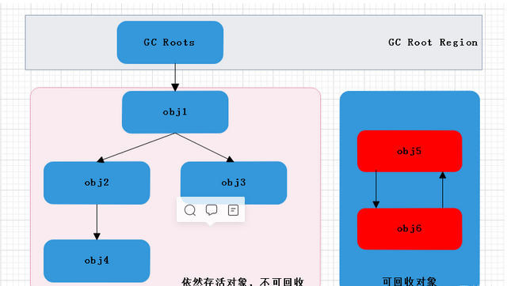
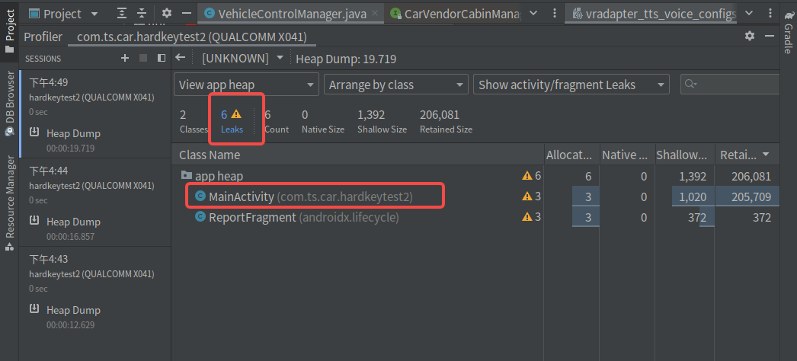
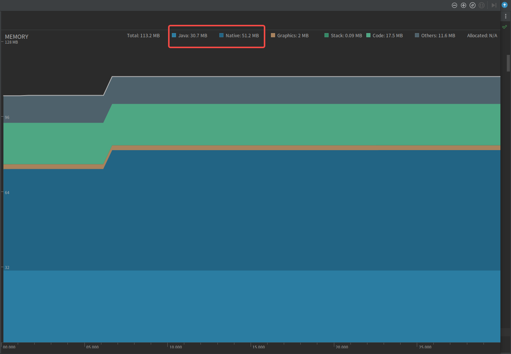

# 内存泄露问题分析

## 一 问题描述

长时间前台运行车辆设置，存在内存泄漏情况（com.ts.faerie.hmi.vehicle_MEM），具体情况如下：

1.电源上电，车机正常启动

2.运行monkey程序13h

3.绘制内存占用曲线图


可以看到，在monkey测试中，我们的内存是一致上升的状态，显然的发生了内存泄露，如果monkey的事件足够长，可能会导致OOM，导致车机崩溃的风险，这显然是不被允许的，
一波优化后，发现HardKeyManager还是存在泄漏问题，Leak Canary的 分析如下：


有了如上信息我们就可以找到 内存泄露问题代码如下(已经去除关键信息)

```java

package com.ts.car.hardkeytest2;

public class MainActivity extends AppCompatActivity {  // class类加载的时候放在方法区

    private static final String TAG = "TestActivity";  // 类加载的时候放在方法区中静态常量池中的对象
    
    private platFormHardKeyManager mHardKeyManager; // 类初始化的时候为null，未创建对象

    @Override
    protected void onCreate(Bundle savedInstanceState) {
        super.onCreate(savedInstanceState); // android 源码，不会发生内存泄露，不再分析其内存结构
        setContentView(R.layout.activity_main); // android 源码，不会发生内存泄露，不再分析其内存结构
        mHardKeyManager = new platFormHardKeyManager(this); // HardKeyManager 对象放在堆区，持有Activity的Context引用
        mHardKeyManager.addKeyEventListener(mxxListener, scnenType_1); // HardKeyManager 内部持有IKeyEventListener的引用
        mHardKeyManager.addKeyEventListener(mxxListener, scnenType_2);
    }
    

    public IKeyEventListener mxxListener = new IKeyEventListener() {
        // MainActivity类创建的时候初始化，创建 IKeyEventListener对象，堆中分配 ，内部类持有 MainActivity的引用，MainActivity 堆中分配 
        @Override
        public void onKeyEvent(KeyEvent keyEvent, int i, int i1) {
            LogUtil.logD(TAG, "mSceneCallback: code = "
                    + keyEvent.getKeyCode() + ", scene = " + i);
        }
    };

    @Override
    protected void onDestroy() {
        super.onDestroy(); // android 源码，不会发生内存泄露，不再分析其内存结构
        try {
            if (mHardKeyManager != null) {
                mHardKeyManager.removeKeyEventListener(mxxListener, scnenType_1);
                mHardKeyManager.removeKeyEventListener(mxxListener, scnenType_2);
                mHardKeyManager.unregisterConnectionListener(this);
            }
        } catch (RemoteException exception) {
            exception.printStackTrace();
        }
    }
}
```
```java
public class PlatformHardKeyManager {

    private List<KeyEventListener> mKeyListeners; // 类加载的时候，引用初始化为null， 未创建对象

    private ServiceConnection PersonConnection  = new ServiceConnection()
    {
        @Override
        public void onServiceDisconnected(ComponentName name)
        {
            mIBinder = null;
        }

        @Override
        public void onServiceConnected(ComponentName name, IBinder service)
        {
            mIBinder = IHardKeyPolicyManager.Stub.asInterface(service);
        }
    };
    
    @PlatformConstruction
    public PlatformHardKeyManager(Context context) {
        super(context);
        Log.d(TAG, "PlatformHardKeyManager Started.");
        Intent intent = new Intent(context, xxxService.class);
        context.bindService(intent, PersonConnection, Context.BIND_ABOVE_CLIENT);
        mKeyListeners = new ArrayList<>();
        // PlatformHardKeyManager初始化的时候创建， 指向一个空数组没分配任何内存空间。真正分配内存是第一次插入数据时  如果是第一次插入后扩容大小为10，
        // private static final Object[] DEFAULT_CAPACITY_EMPTY_ELEMENT_DATA = {};  
        // public ArrayList() {
        // this.elementData = DEFAULT_CAPACITY_EMPTY_ELEMENT_DATA;
        // }
    }

    @Override
    public boolean addKeyEventListener(IKeyEventListener listener, int sceneType) {
        // 在addKeyEventListener方法栈帧中持有IKeyEventListener对象的引用 IKeyEventListener对象 GC Root可达
        if (listener == null || sceneType <= 0) {
            return false;
        }
        KeyEventListener eventListener = findKeyEventListener(listener, sceneType);
        if (eventListener != null) {
            return false;
        }
        eventListener = new KeyEventListener(listener, sceneType);
        // 在addKeyEventListener方法栈帧中创建对象 KeyEventListener， KeyEventListener内部持有IKeyEventListener的引用
        mKeyListeners.add(eventListener); // KeyListeners数组内部持有KeyEventListener的引用
        try {
            mIBinder.addKeyEventCallBack(eventListener, sceneType);
        } catch (RemoteException e) {
            e.printStackTrace();
        }
        return true;
    }

    private KeyEventListener findKeyEventListener(IKeyEventListener listener, int sceneType) {
        synchronized (this) {
            for (KeyEventListener l : mKeyListeners) {
                if (l.mListener == listener && l.mSceneType == sceneType) {
                    return l;
                }
            }
        }
        return null;
    }

    @Override
    public boolean removeKeyEventListener(IKeyEventListener listener, int sceneType) {
        if (listener == null || mService == null) {
            return false;
        }
        List<KeyEventListener> findListeners = new ArrayList<>(); // 初始化一个空数组
        synchronized (this) {
            for (KeyEventListener l : mKeyListeners) {
                if (l.mListener == listener) {
                    if (sceneType == -1 || l.mSceneType == sceneType) {
                        findListeners.add(l);
                    }
                }
            }
            for (KeyEventListener l : findListeners) {
                mKeyListeners.remove(l);
            }
        }
        for (KeyEventListener l : findListeners) {
            try {
                mIBinder.removeKeyEventCallBack(l, l.mSceneType);
            } catch (RemoteException e) {
                e.printStackTrace();
            }
        }
        return true;
    }
    //////////////////////////////////////////////////////////////////////////////////////
    static class KeyEventListener { // 

        IKeyEventListener mListener;
        int mSceneType;

        public KeyEventListener(IKeyEventListener listener, int sceneType) {
            mListener = listener; // 发生内存泄露的引用
            mSceneType = sceneType;
        }

        @Override
        public void onKeyEvent(KeyEvent event, int sceneType, int targetDisplay) {
            mListener.onKeyEvent(event, sceneType, targetDisplay);
        }

        @Override
        public void onKeyLongPress(KeyEvent event, int sceneType, int targetDisplay) {
            //never happened.
        }
    }
}

```

> 如上就是所有的场景信息， 那么就开始分析上述代码为什么会产生内存泄露并解决它，再解决内存泄露之前，我们不得不再了解一些背景知识， Android 虚拟机

## 二 Android虚拟机

首先Android中使用的ART虚拟机，在Android 5.0以前是Dalvik虚拟机，这两种虚拟机与Hotspot基本是一样的，差别在于两者执行的指令集是不一样的，
Android中指令集是基于寄存器的，而Hotspot是基于堆栈的；还有就是Android虚拟机不能执行class文件，而是执行dex文件。
而Art的其中一大职责就是负责垃圾回收。Art会在适当的时机触发GC操作，一旦进行GC操作，就会将一些不再使用的对象进行回收。


我们知道JVM的内存区域主要分为程序计数器、虚拟机栈、本地方法栈、方法区、堆。那么哪个才是GC作用的区域呢？

答案是堆区，前面几块数据区域都不进行 GC。对象实例和数组都是在堆上分配的，GC 也主要对这两类数据进行回收，ART 虚拟机也是如此。


ART的堆内存跟JVM的堆内存几乎是完全不一样的，主要是分为4块：

1. Image Space：这块区域用于存储预加载的类，在类加载之前自动加载(这个区域不会发生GC)

2. Zygote Space：用于存储Zygote进程启动之后，预加载的类和创建的对象

3. Allocation Space：用于存储用户数据，我们自己写的代码创建的对象，类似于JVM中堆的新生代

4. LargeObject Space：用于存储超过12K（3页）的大对象，类似于JVM堆中的老年代

### 2.1 如何判断是否是垃圾：

目前主要有两种判定算法：引用计数算法和可达性分析算法。Art采用的是第二种算法。

> 可达性分析算法的原理是以一系列叫做 GC Root 的对象为起点出发，引出它们指向的下一个节点，再以下个节点为起点，引出此节点指向的下一个结点(这样通过 GC Root 串成的一条线就叫引用链)，
直到所有的结点都遍历完毕。如果相关对象不在任意一个以 GC Root 为起点的引用链中，则这些对象会被判断为垃圾，会被 GC 回收。



**There are 4 main types of GC root:**

1. Local variables, which belong to the stack of a thread. 线程虚拟机栈

2. Instances of active Java threads. Java 线程实例

3. System Classes, which never unload. 永不卸载的系统类

4. Native references, which are controlled by native code. 本地方法占中的引用

5. 方法区中类静态属性,常量引用的对象

### 2.2 ART 垃圾回收策略

> 在ART中存在3种GC策略，内部采用的垃圾回收器是CMS：

1. 浮游GC：这次GC只会回收上次GC到本次GC中间申请的内存空间；

2. 局部GC：除了Image Space和Zygote Space之外的内存区域做一次内存回收；

3. 全量GC：除了Image Space之外，全部的内存做一次内存回收。

ART分配对象的时候，会从第一个策略开始依次判断是否有足够空间分配内存，如果不够就继续往下走；如果全量GC都无法分配内存，那么就判断是否能够扩容堆内存。

CMS垃圾回收器，是JDK1.5之后发布的第一款真正意义上的并发垃圾回收器。它采用的思想是并发标记 - 清除 - 整理，真正去优化因为STW带来的性能问题。

这里先看下CMS的具体工作原理

（1）标记GC ROOT对象；这个过程时间短，会STW；

（2）标记整个GC ROOT引用链；这个过程耗时久，采用并发标记的方式，与用户线程混用，不会STW，因为耗时比较久，在此期间可能会产生新的对象；

（3）重新标记；因为第二步可能产生新的对象，因此需要重新标记数据变动的地方，这个过程时间短，会STW；

（4）并发清理；将标记死亡的对象全部清除，这个过程不会STW；

看到上面的主要过程后，可能会问，整理内存并没有做，那么是什么时候完成的内存整理呢？
其实CMS内存整理并不是伴随着每次GC完成的，而是开启定时，在空闲的时间完成内存整理，因为内存整理会导致STW，这样就不会影响到用户体验。


## 三 什么是内存泄露

> 内存随着使用不断上升
[内存泄露——泄露](Image/p6.png)

先来看看官方的解释：

> A memory leak is a programming error that causes an application to keep a reference to an object that is no longer needed.
> Somewhere in the code, there’s a reference that should have been cleared and wasn’t.

由上述可知，内存泄露是应用程序引用这一个不再需要的对象，本应该被垃圾回收，但是并没有，那什么样的对象不会被垃圾回收呢?

由上述可知， 被GC Root 引用的对象，不会被GC回收。所以， 来回归到我们的代码，来看一下那些对象引起了内存泄露：

在LeakCanary 中的信息已经很好的提示了我们当前内存泄露的GC 引用链


信息如下

com.ts.car.hardkeytest2.MainActivity 没有被回收， 但是MainActivity的onDestroy已经执行过了, 正常的情况下此Activity应该已经被回收了

当前Activity正在被一个实现了IkeyEventListener的匿名内部类（Anonymous Class） 引用， 而这个匿名内部类也被PlatformHardKeyManager&KeyEventListener.mListener引用

所以从调用链来看， PlatformHardKeyManager&KeyEventListener.mListener为此链的GCRoot， 只要它没有被释放， MainActivity就不会被释放，所以造成了内存泄露。

利用Android Studio的Profiler 在对Java内存堆栈进行分析也恰恰验证了这一说法



GC 引用链


既然我们知道了是因为mListener 持有了Activity的引用，mListener没有被释放，所以Activity也没有被释放造成了内存泄露，那修改的方法就比较简单了

1. 将匿名内部类改成静态的, 便不会再持有Activity的引用，会被正常的释放。
```java
class Activity {
    public static IKeyEventListener mxxListener = new IKeyEventListener() {
        // MainActivity类创建的时候初始化，创建 IKeyEventListener对象，堆中分配 ，内部类持有 MainActivity的引用，MainActivity 堆中分配 
        @Override
        public void onKeyEvent(KeyEvent keyEvent, int i, int i1) {
            LogUtil.logD(TAG, "mSceneCallback: code = "
                    + keyEvent.getKeyCode() + ", scene = " + i);
        }
    };
}
```
通过验证Leak Canary 验证 和 Profiler 验证果然已经不存在内存泄露了，来看一下运行时内存相对稳定


但是让我们再来看一下 造成内存泄露的PlatformHardKeyManager&KeyEventListener.mListener, 事情好像并没有这么简单， 我们的mListener虽然持有Activity的对象

但是我们操作 mListener 似乎都是成对的操作， 再本地和服务器注册了此Listener，随后Activity.onDestroy()使用完毕后本地和服务器都删除了此Listener的引用

作为GC root的地方都没有了 mListener 的引用，垃圾回收本应该回收调此次引用，但是为什么没有呢？ Java的垃圾回收没有那么傻，内部类和外部类互相引用还是可以正常回收的

> 简单复习下Android 的GC Root

1、寄存器
位于Cpu内部，速度最快。
2、栈
用于存放基本类型以及引用变量。
3、堆
主要用于存放数组和new出来的对象，它由垃圾回收器进行管理（GC）。对内存的优化也是处理的堆内存。
4、静态存储区
存储应用运行一直存在的数据（static变量）
5、常量池
存放定义的常量（static final）

但是我们所有的工具分析却明确的告诉我们 mListener 是没有被释放调的， 一头雾水后，我改用代码排查。

最终发现如果把  

```java
mIBinder.addKeyEventCallBack(eventListener, sceneType);
mIBinder.removeKeyEventCallBack(l, l.mSceneType);
```

删除掉是没有内存泄露发生的。

这是为什么呢？

我们都知道， AIDL 是Android 提供的跨进程的方式，在编译期间会为我们生成Java代码，会不会和这些代码有关？

我们找到 addKeyEventCallBack(eventListener, sceneType)的AIDL代码 [IxxManager](JavaFile/IHardKeyPolicyManager.java)

截取部分AIDL 自动生成的代码
```java
    private static class Proxy implements com.ts.car.hardkeytest2.IHardKeyPolicyManager
{
    private android.os.IBinder mRemote;
    Proxy(android.os.IBinder remote)
    {
        mRemote = remote;
    }
    @Override public android.os.IBinder asBinder()
    {
        return mRemote;
    }
    public java.lang.String getInterfaceDescriptor()
    {
        return DESCRIPTOR;
    }
    @Override public void addKeyEventCallBack(com.ts.car.hardkeytest2.IKeyEventCallback callback, int sceneType) throws android.os.RemoteException
    {
        android.os.Parcel _data = android.os.Parcel.obtain();
        android.os.Parcel _reply = android.os.Parcel.obtain();
        try {
            _data.writeInterfaceToken(DESCRIPTOR);
            _data.writeStrongBinder((((callback!=null))?(callback.asBinder()):(null)));
            _data.writeInt(sceneType);
            boolean _status = mRemote.transact(Stub.TRANSACTION_addKeyEventCallBack, _data, _reply, 0);
            if (!_status && getDefaultImpl() != null) {
                getDefaultImpl().addKeyEventCallBack(callback, sceneType);
                return;
            }
            _reply.readException();
        }
        finally {
            _reply.recycle();
            _data.recycle();
        }
    }
    @Override public void removeKeyEventCallBack(com.ts.car.hardkeytest2.IKeyEventCallback callback, int sceneType) throws android.os.RemoteException
    {
        android.os.Parcel _data = android.os.Parcel.obtain();
        android.os.Parcel _reply = android.os.Parcel.obtain();
        try {
            _data.writeInterfaceToken(DESCRIPTOR);
            _data.writeStrongBinder((((callback!=null))?(callback.asBinder()):(null)));
            _data.writeInt(sceneType);
            boolean _status = mRemote.transact(Stub.TRANSACTION_removeKeyEventCallBack, _data, _reply, 0);
            if (!_status && getDefaultImpl() != null) {
                getDefaultImpl().removeKeyEventCallBack(callback, sceneType);
                return;
            }
            _reply.readException();
        }
        finally {
            _reply.recycle();
            _data.recycle();
        }
    }
    public static com.ts.car.hardkeytest2.IHardKeyPolicyManager sDefaultImpl;
}
```

我们可以看到如下关键代码：

    _data.writeStrongBinder((((callback!=null))?(callback.asBinder()):(null)));

所以大概可以猜测到：

Listener泄漏是因为改对象最终会调用Parcel.writeStrongBinder() 方法，该方法是 native 方法，所以最终是 native 持有了这个对象，导致无法回收。

那他不会在调用 removeListener 的时候释放吗？

因为是Java代码，后续便不得而知了

大胆来猜测一下

1. 不管是Activity直接继承AIDL的listener还是通过非静态内部类来继承AIDL的listener，在调用addListener直接和服务端进行通信后，服务端持有了该Activity的引用。

2. 在调用delListener直接和服务端进行通信，由服务端删除了该listener后，此时由服务器端的垃圾回收接管了该listener。

3. 由于服务器端垃圾回收触发时机的不确定性，导致该Activity被延迟销毁了。

那我们来验证一下我们的猜测

可以看我们内存变化


可以看到，我们的应用程序的内存随着我得操作，虽然在段时间内持续爬升 峰值达到了50M，但一定事件又释放了，最后趋于稳定的30M左右

内存初始值大小


这大概可以验证了我们的猜想。

那我们现在大概请吃了内存泄露的原因，怎么避免这种情况呢？

1. Android的SDK设计时，在AIDL的客户端设计了一些帮助类，避免应用直接操作AIDL的listener。这样客户端的回调就被帮助类所持有，而非直接由服务端所持有。虽然帮助类仍然在服务端垃圾回收才可能释放，但是避免了使用者在Activity实现接口导致Activity难以释放问题。
2.    BinderProxy.delListener(iStub); 
      iStub = null;  // 手动至null
3. Activity使用静态内部类来跟AIDL进行操作。

以上分析和猜测不保证百分百正确，如有了解人士，欢迎补充修正

## 总结

最后可以来看一下常见的内存泄露的场景，避免在生产环境中遇到这样的问题。

1、单例模式导致的内存泄漏 


问题原因：

单例模式的内存泄漏一般是由上下文的生命周期引起的。因为单例模式的静态特性导致它的生命周期和应用的生命周期一样长，
当单例引用了比它生命还短的对象时候，将导致这个短生命周期的对象无法被释放掉，从而导致内存泄漏。如下示例代码，模拟了单例导致的内存泄漏。

解决方式：
当然解决办法也很简单，只需要将引用对象的生命和单例类一致就OK了。
通常的做法是将传入单例的的上下文参数做下转换调用它的getApplicationContext()即可。

2、匿名内部类导致的内存泄漏

问题原因：

匿名类、非静态内部类都会引用它们所属的外部类，当这些内部类进行一些耗时操作的时候就会导致外部类的实例无法被释放掉，从而导致内存泄漏的发生。

解决方法：

将非静态匿名内部类修改成静态匿名内部类

3、Handler引起的内存泄漏

问题原因：

当Handler中有延迟的的任务或是等待执行的任务队列过长，由于消息持有对Handler的引用，而Handler又持有对其外部类的潜在引用，这条引用关系会一直保持到消息得到处理，
而导致了Activity无法被垃圾回收器回收，而导致了内存泄露。

解决方法：

将Handler定义成静态内部类，在界面的onDestroy方法移除消息回调等。

4、注册监听器的泄漏

注册和解注册一定要配对出现，否则就会出现内存泄漏。例如我们在activity的的onCreate方法注册了动态广播，那么在onDestroy()中就的解注册该动态广播

5、IO流数据库之类导致的内存泄漏

OutputStream、 InputStream以及相关的子类需要在finally块中进行及时关闭释放资源。数据库主要是Cursor游标、数据库的关闭。

6、集合中对象没清理造成的内存泄漏

我们通常把一些对象的引用加入到了集合容器（比如ArrayList）中，当我们不需要该对象时，并没有把它的引用从集合中清理掉，
这样这个集合就会越来越大。如果这个集合是static的话，那情况就更严重了。所以退出界面集合需要清空并设置为null

7、WebView造成的泄漏

对于显示webview的组件activity设置单独的运行进程，可以处理简单无交互的webview显示网页，
在退出界面的时候杀死进程或者退出整个进程即可。对于复杂的需要和启动方主进程交互的需要使用aidl方式进行进程间通信。


参考： https://blog.csdn.net/u014600432/article/details/78157235