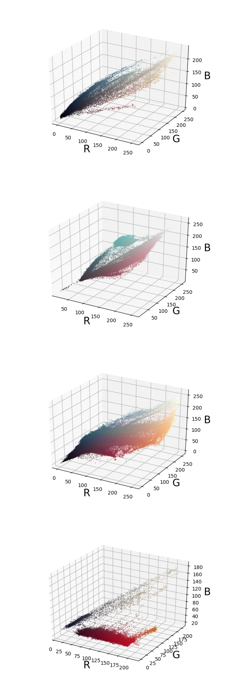

## Median Cut Algorithm

Median cut algorithm is an adaptive algorithm for color quantization to select the best representative subset of colors. 
It is used, for example, in the palette generation process.

The median cut algorithm is a popular solution for optimized palette generation [1].

The idea behind the median cut algorithm is to use each of the colors in the synthesized look-up table to represent the 

equal number of pixels in the original image. The algorithm subdivides the color space interactively into smaller and smaller boxes. 

In contrast to uniform subdivision, optimized palette generation algorithms divide the color space based on the distribution of the original colors. 

The algorithm starts with a box that encloses all the different color values from the original image. 

The dimensions of the box are given by the minimum and maximum of each of the color coordinates that encloses the box under consideration. 

The box is split just choosing the side...


## 根据一张图片获取主颜色的算法是什么样的?

写这种应用一般不用关心底层算法，直接调用 API 就行了，比如 Android 上就直接提供了 Palette 类来做这种提取：

```c
// bitmap 是一张图片，palette 就是量化后的调色板
Palette palette = Palette.from(bitmap).generate();
// 调色板提供了六种不同的选色方案，这里的 Vibrant 是其中一种
palette.getVibrantColor(); // 返回对应颜色
palette.getVibrantSwatch(); // 包含了使用这种背景色时，推荐的对应的正文色、标题色等信息
```
当然如果你要看 generate() 到底使用了什么算法的话，可以看[源代码](https://github.com/aosp-mirror/platform_frameworks_support/blob/b9cd83371e928380610719dfbf97c87c58e80916/palette/palette/src/main/java/androidx/palette/graphics/ColorCutQuantizer.java)。

目前的实现中使用的是 Median-Cut（中位切割）算法。
大致意思就是把所有像素按照跨度最大的通道排序，从中间位置切割成两组，然后对每一组像素再重复这个操作，直到达到你想要的数量为止，最后把每一组内的所有像素求平均。

量化 ：到底是最亮的、最暗的、对比度最高的……总之确定需求以后，先转成 HSL，就可以来排序了。

求较深、较浅、补色也一样，先转成 HSL，然后按照三者的定义来调整对应的通道就可以了。


## 图像主色提取算法

我们在网易云上听歌, 略加设置就能看到这样的效果:


网易云是怎么提取出专辑封面主要颜色的呢 首先, 我们需要思考如何表示一张图片. 

图片是由一系列像素点组成的, 最简单的表示图片的方法就是用位图, 也即记录下每个像素点的 rgb 来表示 

所以我们可以用一个 width * height * 3 的数组来表示一张图片, 其中 width 和 height 分别表示宽高, 3 代表 r,g,b 三个通道我们以以下4张图片为例进行说明


将他们分别表示为 rgb 像素点, 以 rgb 作为 xyz 坐标, 标注在三维空间中即是这样:



以上是简要说明, 下面将介绍三种常见的图片主题色提取算法的具体实现:

## 中位切分

1. 将图片每个像素的 r,g,b 值分别作为 x,y,z 坐标, 标在空间坐标系中
2. 用一个最小的立方体框住所有点
3. 将立方体沿一平面切分, 该平面与立方体最长边方向垂直, 使切分得的两部分包含相同数量的像素点
4. 将分得的小立方体递归地按照 3. 的算法切分, 直至分得立方体个数等于所需颜色数即可
5. 将每个立方体中颜色做平均, 即得到最后的主色

其中, 在进行切分时可对待切割立方体做一个排序, 其中单位体积包含像素点越多的立方体越先被切割, 以提高效率


## Android Palette（调色板）


android-support-v7-palette 里面的Palette是Android L SDK 中的新特性，可以使用 Palette 从图像中提取出突出的颜色(主色调)，

获取到颜色之后我们再将这个颜色值赋给 ActionBar、状态栏等。从而达到界面色调的统一，使界面美观协调。

原理

通过得到一个bitmap，通过方法进行分析，取出

1. LightVibrantSwatch
2. DarkVibrantSwatch
3. LightMutedSwatch
4. DarkMutedSwatch

这些样本，然后得到rgb。

Palette这个类中提取以下突出的颜色

Vibrant (有活力)
Vibrant dark(有活力 暗色)
Vibrant light(有活力 亮色)
Muted (柔和)
Muted dark(柔和 暗色)
Muted light(柔和 亮色)


