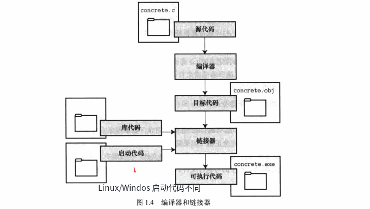
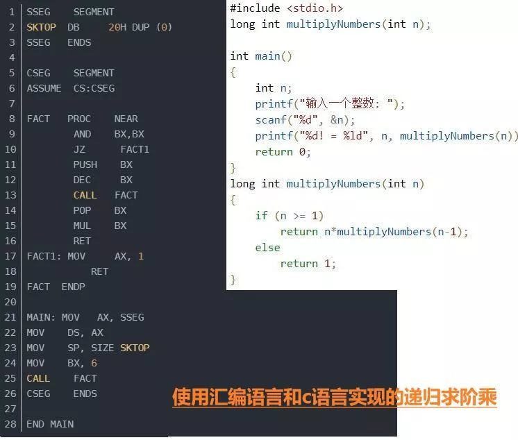
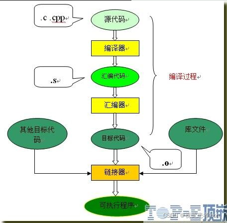
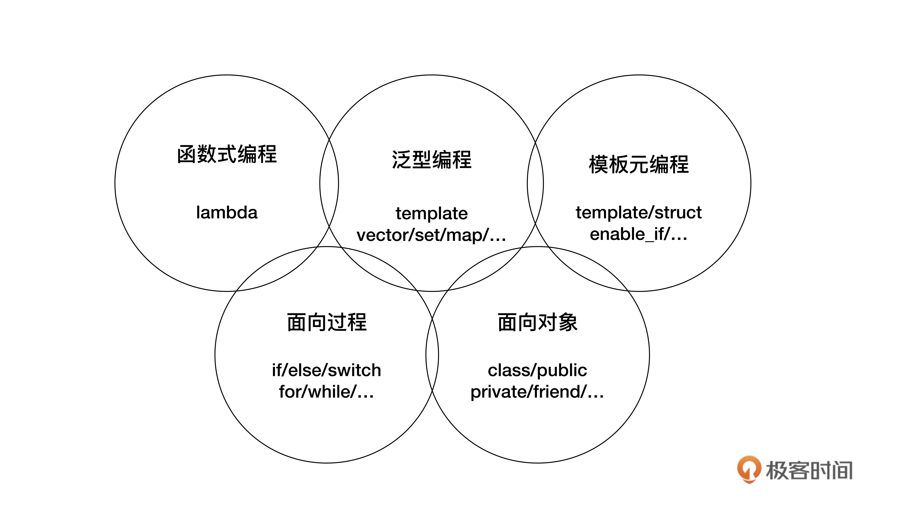
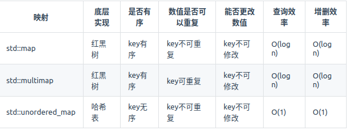
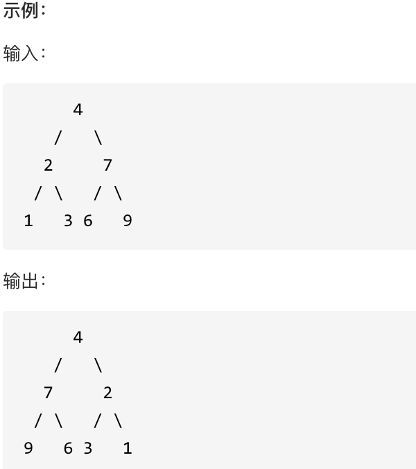

# 编程范式

## 1. C 语言


> 如今这世界上，凡是带电的地方，可能都会有她(C语言)或者她的子孙的影子。
> 
> 任何比C语言更低级的语言，都不足以完整地抽象一个计算机系统；任何比C高级的语言，都可以用C来实现。

C 语言历史悠久，而几乎现在看到的所有编程语言都是以 C 语言为基础来拓展的，不管是 C++、Java、C#、Go、Python、PHP、Perl、JavaScript、Lua，还是 Shell。
C 语言问世 40 多年以来，其影响了太多太多的编程语言，到现在还一直被广泛使用，不得不佩服它的生命力。

### 1.1 C语言之父


C语言之父, 丹尼斯·麦卡利斯泰尔·里奇（英语：Dennis MacAlistair Ritchie，1941年9月9日－2011年10月12日）－2011年10月12日），美国计算机科学家。
黑客圈子通常称他为“dmr”。他是C语言的创造者、Unix操作系统的关键开发者，对计算机领域产生了深远影响，并与肯·汤普逊同为1983年图灵奖得主。

麻省理工大学计算机系的马丁教授评价说："如果说，乔布斯是可视化产品中的国王，那么里奇就是不可见王国中的君主。
乔布斯的贡献在于，他如此了解用户的需求和渴求，以至于创造出了让当代人乐不思蜀的科技产品。
然而，却是里奇先生为这些产品提供了最核心的部件，人们看不到这些部件，却每天都在使用着。"克尼汉评价道：牛顿说他是站在巨人的肩膀上，如今，我们都站在里奇的肩膀上。


### 1.2 C语言的发展


1973年，肯·汤普逊(Ken Thompson)和里奇合作把Unix的90%以上用C语言改写，即Unix第五版。
这是C语言第一次应用在操作系统的核心编写上。随着Unix的日益广泛使用，C语言也迅速得到推广。

随着Unix的发展，C语言也得到了不断地完善。C语言是一门面向过程地、抽象化的编程语言，广泛应用于底层开发。
C语言能用简易的方式编译、处理低级存储器。如此简单，简洁，几乎每个计算机制造商都转向了它，且效果显著。

为了利于C语言的全面推广，很多专家学者和硬件产商联合组成了C语言标准委员会。
于是在1989年，第一个完备的C标准诞生了，简称“C89”，截至目前，最新的C语言标准为2017年发布的“C17”。

C语言开始移植到其他机器上使用。史蒂芬·强生(Stephen C.Johnson)实现了一套“可移植编译器”，这套编译器修改起来相对容易，并且可以为不同的机器生成代码。
从那时起，C语言在大多数计算机上被使用，C语言很规范，即使没有一份正式的标准，也可以写出C程序，这些程序无需修改就可以运行在任何支持C语言的最小运行时环境的计算机上。

1978年以后，C语言先后移植到大，中，小和微型计算机上。C语言便很快风靡全球，成为世界上应用最为广泛的程序设计高级语言。

### 1.3 C语言编译器

C语言编译器普遍存在于各种不同的操作系统中，例如Microsoft Windows、macOS、Linux、Unix等。

C语言编写程序时， 编写的内容都被存储到文本文件中，该文件被成为源代码文件（source code file）。wordCount.c 基本名称+扩展名称

C语言的基本策略是：吧源代码文件转换为可执行文件（包含饥饿直接运行的机器语言代码）。典型的C通过编译和连接两个步骤来完成这一过程。编译器把源代码转换成中间代码，连接器把中间代码和其他代码合并，
生成可执行文件，C 使用这种分而治之的方法方便对程序进行模块化，可以独立编译单独的模块，然后再用连接器合并已经编译的模块，通过这种方式，如果只更改某个模块，不必因此重新编译其他模块。另外连接器还讲你编写的程序和预编译的库代码合并。



Linux 是一个开源，流行，类似宇UNIX的操作系统，使用 GNU提供的GCC公共域C编译器。编译命令类似：

```shell
gcc inform.c
```

> 大家都用C语言或基于C语言的语言来写编译器， 但是我们知道C语言也是一种高级语言， 那第一个C语言编译器是怎样编写的？

Tomphson在BCPL的基础上开发了B语言，Ritchie又在B语言的基础上成功开发出了现在的C语言。

在C语言被用作系统编程语言之前，Tomphson也用过B语言编写过操作系统。可见在C语言实现以前，B语言已经可以投入实用了。
因此第一个C语言编译器的原型完全可能是用B语言或者混合B语言与PDP汇编语言编写的。但是B语言的执行效率比较低，

但是如果全部用汇编语言来编写，不仅开发周期长、维护难度大，更可怕的是失去了高级程序设计语言必需的移植性。



C语言编译器，就是把编程得到的文件，比如.c,.h的文件，进行读取，并对内容进行分析，按照C语言的规则，将其转换成cpu可以执行的二进制文件。
其本质在于对文件的读入，分析，及处理。这些操作，C语言都是可以实现的。 所以用C语言来做C语言的编译器是完全可行的。

所以C语言编译器就采取了一个取巧的办法：

先用汇编语言编写一个C语言的一个子集的编译器，再通过这个子集去递推，进而完成完整的C语言编译器。


那么这种大胆的子集简化的方法，是怎么实现的，又有什么理论依据呢？

#### “自编译”Self-Compile 0生1，1生C，C生万物

先介绍一个概念，“自编译”Self-Compile，也就是对于某些具有明显自举性质的强类型
（所谓强类型就是程序中的每个变量必须声明类型后才能使用，比如C语言，相反有些脚本语言则根本没有类型这一说法） 编程语言，
可以借助它们的一个有限小子集，通过有限次数的递推来实现对它们自身的表述，这样的语言有C、Pascal、Ada等等，至于为什么可以自编译，
可以参见清华大学出版社的《编译原理》，书中实现了一个Pascal的子集的编译器。

例如：
1. 控制循环和分支的都有多种表述方法，其实都可简化成一种，具体的来说，循环语句有while循环，do…while循环和for循环，只需要保留while循环就够了。

2. 分支语句又有if…{}, if…{}…else, if…{}…else if…, switch，这四种形式，它们都可以通过两个以上的if…{}来实现，因此只需要保留if,…{}就够了。

3. 可是再一想，所谓的分支和循环不过是条件跳转语句罢了，函数调用语句也不过是一个压栈和跳转语句罢了，因此只需要goto（未限制的goto）。


### 1.4 C 语言编程范式

> 编程范式的英语是 Programming Paradigm，范即模范之意，范式即模式、方法，是一类典型的编程风格，是指从事软件工程的一类典型的风格（可以对照“方法学”一词）。

无论是传统世界，还是编程世界，我们都在干一件事情，什么事呢？ 那就是通过使用一种更为通用的方式，用另外的话说就是抽象和隔离，让复杂的“世界”变得简单一些。


然而，要做到抽象，对于 C 语言这样的类型语言来说，首先要拿出来讲的就是抽象类型，这就是所谓的泛型编程。类型转换有时候可以让我们编程更方便一些，也让相近的类型可以做到一点点的泛型。

自 C 语言问世 40 多年以来，其影响了太多太多的编程语言，到现在还一直被广泛使用，不得不佩服它的生命力。
但是，我们也要清楚地知道，大多数 C Like 编程语言其实都是在改善 C 语言带来的问题。

那 C 语言有哪些特性呢？

1. C 语言是一个静态弱类型语言，在使用变量时需要声明变量类型，但是类型间可以有隐式转换；
2. 不同的变量类型可以用结构体（struct）组合在一起，以此来声明新的数据类型；
3. C 语言可以用 typedef 关键字来定义类型的别名，以此来达到变量类型的抽象；
4. C 语言是一个有结构化程序设计、具有变量作用域以及递归功能的过程式语言；
5. C 语言传递参数一般是以值传递，也可以传递指针；
6. 通过指针，C 语言可以容易地对内存进行低级控制，然而这加大了编程复杂度；
7. 编译预处理让 C 语言的编译更具有弹性，比如跨平台。

C 语言的这些特性，可以让程序员在微观层面写出非常精细和精确的编程操作，让程序员可以在底层和系统细节上非常自由、灵活和精准地控制代码。

然而，在代码组织和功能编程上，C 语言的上述特性，却不那么美妙了。

我们从 C 语言最简单的交换两个变量的 swap 函数说起，参看下面的代码：

```C
void swap(int* x, int* y)
{
  int tmp = *x;
  *x = *y;
  *y = tmp;
}
```
这里是 C 语言指针，因为如果你不用指针的话，那么参数变成传值，即函数的形参是调用实参的一个拷贝，函数里面对形参的修改无法影响实参的结果。
为了要达到调用完函数后，实参内容的交换，必须要把实参的地址传递进来，也就是传指针。这样在函数里面做交换，实际变量的值也被交换了。

然而，这个函数最大的问题就是它只能给 int 值用，这个世界上还有很多类型包括 double、float，这就是静态语言最糟糕的一个问题

对于 C 语言的类型转换，是会出很多问题的。比如说，传给我一个数组，这个数组本来是 double 型的，或者是 long 型 64 位的，但是如果把数组类型强转成 int，那么就会出现很多问题，因为这会导致程序遍历数组的步长不一样了

比如：一个 double a[10] 的数组，a[2] 意味着 a + sizeof(double) * 2。
如果你把 a 强转成 int，那么 a[2] 就意味着 a + sizeof(int) * 2。
我们知道 sizeof(double) 是 8，而 sizeof(int) 是 4。于是访问到了不同的地址和内存空间，这就导致程序出现严重的问题。

#### 1.4.1 C 语言的泛型

一个泛型的示例 - swap 函数好了，我们再看下，C 语言是如何实现泛型的。

C 语言的类型泛型基本上来说就是使用void *关键字或是使用宏定义。下面是一个使用了void* 泛型版本的 swap 函数。

```shell

void swap(void* x, void* y, size_t size)
{
     char tmp[size];
     memcpy(tmp, y, size);
     memcpy(y, x, size);
     memcpy(x, tmp, size);
}
```
这个实现方式有三个重点：

1. 函数接口中增加了一个size参数。 因为，用了 void* 后，类型被“抽象”掉了，编译器不能通过类型得到类型的尺寸了，所以，需要我们手动地加上一个类型长度的标识。
2. 函数的实现中使用了memcpy()函数。还是因为类型被“抽象”掉了，所以不能用赋值表达式了，很有可能传进来的参数类型还是一个结构体，因此，为了要交换这些复杂类型的值，我们只能使用内存复制的方法了。
3. 函数的实现中使用了一个temp[size]数组。这就是交换数据时需要用的 buffer，用 buffer 来做临时的空间存储。

于是，新增的size参数，使用的 memcpy 内存拷贝以及一个 buffer，这增加了编程的复杂度。这就是 C 语言的类型抽象所带来的复杂度的提升。

这种“泛型”是不是太宽松了一些，完全不做类型检查，就是在内存上对拷，直接操作内存的这种方式，感觉是不是比较危险，而且就像一个定时炸弹一样，不知道什么时候，在什么条件下就爆炸了。

这种泛型，让我们根本没有办法检查传入参数的size，导致我们只能增加接口复杂度，加入一个size参数，然后把这个问题抛给调用者了。

### 1.5 C 语言的问题

如果说，程序 = 算法 + 数据，我觉得 C 语言会有这几个问题

1. 一个通用的算法，需要对所处理的数据的数据类型进行适配。但在适配数据类型的过程中，C 语言只能使用 void* 或 宏替换的方式，这两种方式导致了类型过于宽松，并带来很多其它问题。
2. 适配数据类型，需要 C 语言在泛型中加入一个类型的 size，这是因为我们识别不了被泛型后的数据类型，而 C 语言没有运行时的类型识别，所以，只能将这个工作抛给调用泛型算法的程序员来做了。
3. 算法其实是在操作数据结构，而数据则是放到数据结构中的，所以，真正的泛型除了适配数据类型外，还要适配数据结构，最后这个事情导致泛型算法的复杂急剧上升。比如容器内存的分配和释放，不同的数据体可能有非常不一样的内存分配和释放模型；再比如对象之间的复制，要把它存进来我需要有一个复制，这其中又涉及到是深拷贝，还是浅拷贝。
4. 最后，在实现泛型算法的时候，你会发现自己在纠结哪些东西应该抛给调用者处理，哪些又是可以封装起来。如何平衡和选择，并没有定论，也不好解决。

C 语言设计目标是提供一种能以简易的方式编译、处理底层内存、产生少量的机器码以及不需要任何运行环境支持便能运行的编程语言。C 语言也很适合搭配汇编语言来使用。C 语言把非常底层的控制权交给了程序员

### 1.6 C语言设计理念

1. 相信程序员；
2. 不会阻止程序员做任何底层的事；
3. 保持语言的最小和最简的特性；
4. 保证 C 语言的最快的运行速度，那怕牺牲移值性。
5. 使用 C 语言的程序员在高级语言的特性之上还能简单地做任何底层上的微观控制。

而对于更高阶、更为抽象的编程模型来说，C 语言这种基于过程和底层的初衷设计方式就会成为它的短板。
因为，在编程这个世界中，更多的编程工作是解决业务上的问题，而不是计算机的问题，所以，我们需要更为贴近业务、更为抽象的语言。

那 C 语言会怎么去解决这些问题呢？简单点说，C 语言并没有解决这些问题，所以才有了后面的 C++ 等其他语言。

### 1.7 C语言学习

[C语言程序设计实现放发](https://book.douban.com/subject/2280547/)
完整覆盖了 C99 标准，习题的质量和水准也比较高。更好的是，探讨了现代编译器的实现，以及和 C++ 的兼容.


## 2. C++ 语言

C++ 可算是一种声名在外的编程语言了。这个名声有好有坏，从好的方面讲，C++ 性能非常好，哪个编程语言性能好的话，总忍不住要跟 C++ 来单挑一下；
从坏的方面讲，它是臭名昭著的复杂、难学、难用。当然，这样一来，熟练的 C++ 程序员也就自然而然获得了“水平很高”的名声，所以这也不完全是件坏事。

多范式，是因为 C++ 支持面向过程编程，也支持面向对象编程，也支持泛型编程，新版本还可以说是支持了函数式编程。
同时，上面这些不同的范式，都可以在同一项目中组合使用，这就大大增加了开发的灵活性。因此，C++ 适用的领域非常广泛，小到嵌入式，大到分布式服务器，到处可以见到 C++ 的身影。

下面是一些著名的用到 C++ 的场合：

1. 大型桌面应用程序（如 Adobe Photoshop、Google Chrome 和 Microsoft Office）
2. 大型网站后台（如 Google 的搜索引擎）
3. 游戏（如 StarCraft）和游戏引擎（如 Unreal 和 Unity）
4. 编译器（如 LLVM/Clang 和 GCC）
5. 解释器（如 Java 虚拟机和 V8 JavaScript 引擎）
6. 实时控制（如战斗机的飞行控制和火星车的自动驾驶系统）
7. 视觉和智能引擎（如 OpenCV、TensorFlow）
8. 数据库（如 Microsoft SQL Server、MySQL 和 MongoDB）

### 2.1 C++ 之父

本贾尼·斯特劳斯特卢普


在德克萨斯A&M大学担任计算机科学的主席教授。他最著名的贡献就是开发了C++程序设计语言。
1982年，美国AT&T公司贝尔实验室的本贾尼博士在C语言的基础上引入并扩充了面向对象的概念，发明了—种新的程序语言。
为了表达该语言与C语言的渊源关系，它被命名为C++。而本贾尼博士被尊称为C++语言之父。

### 2.2 C++ 语言的发展

C语言作为结构化和模块化的语言，在处理较小规模的程序时，比较得心应手，但是当问题比较复杂，程序的规模较大的时候，需要高度的抽象和建模时，C语言显得力不从心。

这时，也就是20世纪80年代，计算机界提出了OOP（object oriented programming 面向对象编程）思想。Smalltalk就是当时问世的一种面向对象的语言。
但是慢慢的人们发现，C是如此的深入人心，使用是如此的广泛，以至于最好的办法，不是发明一种新的语言去取代它，而是在原有的基础上去发展它。So，C++应运而生。

1. C++98：
   1998年C++标准得到了国际标准化组织（ISO）和美国标准化协会（ANSI）的批准，标准C++语言及其标准库更体现了C++语言设计的初衷。
   名字空间的概念、标准模板库（STL）中增加的标准容器类、通用算法类和字符串类型等使得C++语言更为实用。
   此后C++是具有国际标准的编程语言，该标准通常简称ANSI C++或ISO C++ 98 标准，以后每5 年视实际需要更新一次标准。
2. C++03:
   后来又在2003 年通过了C++标准第二版（ISO/IEC 14882:2003）：这个新版本是一 次技术性修订，对第一版进行了整理——修订错误、减少多义性等，但没有改变语言特性。
   这个版本常被称为C++03
3. C++11:
   国际标准化组织于2011年9 月1 日出版发布《ISO/IEC 14882:2011》，名称是：Information technology --Programming languages -- C++ Edition: 3。

### 2.3 C++ 编译

> C++ 的编译过程： 预处理，编译， 汇编， 链接

一个C++程序中，只包含两类文件——.cpp文件和.h文件。

1. xx.cpp文件被称作C++源文件，里面放的都是C++的源代码；
2. xx.h文件则被称作C++头文件，里面放的也是C++的源代码。

#### 2.3.1 预编译

> 预编译程序所完成的基本上是对源程序的“替代”工作。经过此种替代，生成一个没有宏定义、没有条件编译指令、没有特殊符号的输出文件。这个文件的含义同没有经过预处理的源文件是相同的，但内容有所不同。

源文件.cpp或.c生成.i文件，这是在预编译阶段完成的；（命令：gcc -E .cpp/.c —>.i)

1. 展开所有的宏定义，消除“#define”
2. 处理所有的预编译指令，比如#if、#ifdef等；
3. 处理#include预编译指令，将包含文件插入到该预编译的位置；
4. 删除所有的注释“/**/”、"//"等；
5. 添加行号和文件名标识，以便于编译时编译器产生调试用的行号信息以及错误提醒；
6. 保留所有的#program编译指令，原因是编译器要使用它们；
7. 缺点：不进行任何安全性及合法性检查

#### 2.3.2 编译

> 编译过程，就是把经过预编译生成的文件，进行一系列语法分析、词法分析、语义分析优化后生成相应的汇编代码文件。

由.i文件生成.s文件，这是在编译阶段完成的

```shell
gcc -S .i --> .s
```

1. 词法分析：
   将源代码文件的字符序列划分为一系列的记号。如果存在括号不匹配或者表达式错误，编译器就会报告语法分析阶段的错误。
2. 语法分析：
   语法分析器将对产生的记号进行语法分析，产生语法树----就是以表达式尾节点的树，一步步判断如何执行表达式操作。
3. 语义分析
   由语法阶段完成分析的并没有赋予表达式或者其他实际的意义，比如乘法、加法、减法，必须经过语义阶段才能赋予其真正的意义
4. 优化后生成相应的汇编代码文件
5. 汇总所有符号

#### 2.3.3 汇编
> 生成可重定位的二进制文件（.obj文件）

```shell
gcc -c .s -- .o
```

#### 2.3.4 链接
> 主要是把目标代码（obj文件）与调用的库函数代码或自定义文件代码连接起来，形成对应的可执行文件（exe文件）

链接阶段主要分为两部分：

1. 合并所有“.obj”文件的段，并调整段偏移和段长度（按照段的属性合并，属性可以是“可读可写”、“只读”、“可读可执行”，合并后将相同属性的组织在一个页面内，比较节省空间），合并符号表，进行符号解析完成后给符号分配地址
2. 符号的重定位（链接核心），将符号分配的虚拟地址写回原先未分配正确地址的地方。

对于数据符号会存准确地址，对于函数符号，相对于存下一行指令的偏移量（从PC寄存器取地址，并且PC中下一行指令的地址）

#### 2.3.5 程序运行

> 操作系统是如何管理进程和内存的

1. 创建虚拟地址空间到物理空间的映射（创建内核地址映射结构体），创建页目录和页表。

2. 加载代码段和数据段。

3. 把可执行文件的入口地址写到CPU的PC寄存器里。




1. 编译器会将一个工程里的所有.cpp文件以分离的方式编译完毕后，再由链接器进行链接成为一个可执行文件。
2. 在编译过程中头文件不参与编译，预编译时进行各种替换以后，头文件就完成了其光荣使命，不再具有任何作用。
3. 头文件的作用是保证当前源文件编译不会出错，头文件本身不参与编译过程。


C++在最初设计时是基于C的，绝大多数语法都兼容，C语言常用的(void*)转换在C++中也在很大程度上摒弃了，理由也是类型不安全。
C++所有新特性，用C都能做出来，无论是面向对象还是函数式编程还是面向过程编程。 
c/c++真正区别，编译器会帮你生成c++代码，而c编译器不会，一点儿都不加，c++是天生带着范式的语言，核心范式是类型计算，而c几乎没有范式


### 2.5 C++ 语言编程范式

前面提到编程范式”是一种“方法论”，就是指导你编写代码的一些思路、规则、习惯、定式和常用语。

>编程范式和编程语言不同，有的范式只能用于少数特定的语言，有的范式却适用于大多数语言； 有的语言可能只支持一种范式，有的语言却可能支持多种范式。
>C++ 是支持编程范式最多的一门语言，它虽然解决了很多 C 语言的问题，它最大的意义是解决了 C 语言泛型编程的问题。

C++ 是一种多范式的编程语言。具体来说，现代 C++（11/14 以后）支持“面向过程”“面向对象”“泛型”“模板元”“函数式”这五种主要的编程范式。

C++ 语言的五种范式:



1. 面向过程
   面向过程是 C++ 里最基本的一种编程范式。 它的核心思想是“命令”，通常就是顺序执行的语句、子程序（函数），把任务分解成若干个步骤去执行，最终达成目标。 
   面向过程体现在 C++ 中，就是源自它的前身——C 语言的那部分，比如变量声明、表达式、分支 / 循环 / 跳转语句，等等。
   
2. 面向对象
   面向对象是 C++ 里另一个基本的编程范式。 它的核心思想是“抽象”和“封装”，倡导的是把任务分解成一些高内聚低耦合的对象，这些对象互相通信协作来完成任务。 
   它强调对象之间的关系和接口，而不是完成任务的具体步骤。在 C++ 里，面向对象范式包括 class、public、private、virtual、this 等类相关的关键字，
   还有构造函数、析构函数、友元函数等概念。
   
3. 泛型编程
   泛型编程是自 STL（标准模板库）纳入到 C++ 标准以后才逐渐流行起来的新范式，核心思想是“一切皆为类型”，或者说是“参数化类型”“类型擦除”，
   使用模板而不是继承的方式来复用代码， 所以运行效率更高，代码也更简洁。在 C++ 里，泛型的基础就是 template 关键字，然后是庞大而复杂的标准库，
   里面有各种泛型容器和算法，比如 vector、map、sort，等等。

4. 模板元编程
   它的核心思想是“类型运算”，操作的数据是编译时可见的“类型”，所以也比较特殊，代码只能由编译器执行，而不能被运行时的 CPU 执行。模板元编程是一种高级、
   复杂的技术，C++ 语言对它的支持也比较少。在处理源码时，由于编译器是依据 C++ 语法检查各种类型、函数的定义，所以，在这个阶段，我们就能够以编译器为目标进行编程，
   有意识地控制编译器的行为。
   
5. 函数式编程
   是数学意义上、无副作用的函数，核心思想是“一切皆可调用”，通过一系列连续或者嵌套的函数调用实现对数据的处理 。

总结：
如果是开发直接面对用户的普通应用（Application），那么你可以再研究一下“泛型”和“函数式”，就基本可以解决 90% 的开发问题了；
如果是开发面向程序员的库（Library），那么你就有必要深入了解“泛型”和“模板元”，优化库的接口和运行效率。当然，还有一种情况：如果你愿意挑战“最强大脑”，那么，“模板元编程”就绝对是你的不二选择（笑）。


### 2.5 C++ 语言的优缺点

C++ 语言的优势:
1. C++实现了面向对象程序设计。在高级语言当中，处理运行速度是最快的，大部分的游戏软件，系统都是由C++来编写的。
2. C++语言非常灵活，功能非常强大。如果说C语言的优点是指针，那么C++的优点就是性能和类层次结构的设计。
3. C++非常严谨、精确和数理化，标准定义很细致。
4. C++语言的语法思路层次分明、相呼应;语法结构是显式的、明确的。

C++ 语言的劣势:

难

### 2.6 C++ 语言设计理念

从C++发展历史背景来看，C++产生的根本原因有两点：

面向对象编程 : Bjarne Stroustrup研究Simula OOP编程思想，觉得这个是应对大型软件开发的绝佳武器，拥有很好的现实抽象能力和代码组织能力;

高性能 : Bjarne Stroustrup准备开发一套通信系统，需要编写接近硬件的低级代码，例如内存管理器、进程调度器和设备驱动程序来分离软件组件，
由于当时计算机硬件性能限制， 对软件性能要求苛刻，广泛使用的C语言有比较接近硬件工作的能力，所以Bjarne Stroustrup基于C语言创造可以面向对象编程的C++语言；

> 面向对象程序设计（英语：Object-oriented programming，缩写：OOP）是种具有对象概念的编程典范，同时也是一种程序开发的抽象方针。
> 它可能包含数据、属性、代码与方法。对象则指的是类（class）的实例。它将对象作为程序的基本单元，将程序和数据封装其中，以提高软件的重用性、灵活性和扩展性，
> 对象里的程序可以访问及经常修改对象相关连的数据。在面向对象程序编程里，计算机程序会被设计成彼此相关的对象。提倡用人类在现实生活中常用的思维方法来认识、
> 理解和描述客观事物，具体实现采用对象为基础，对象是面向对象方法中最基本的概念

#### 2.6.1 C++面向对象编程三个核心技术

1. 封装
   
   主要的方法是对象和类， 对象和对象之间隐藏自己内部实现细节，通过标准接口进行通信，这样就可以提高程序内聚，降低耦合，方便系统进行解耦设计，同时也提高了系统稳定性，降低系统风险。
2. 继承
   
   主要的方法通过类的公有继承、保护继承，私有继承，单继承，多继承；结合类成员的三种属性：public、protected 和 private; 来实现共享和限制属性和方法的访问；
   继承的优点是：相似的对象可以共享程序代码和数据结构，从而大大减少了程序中的冗余信息，提高软件的可重用性，便于软件迭代；
3. 多态
   
   编译时多态

     主要的方法是重载和模板，重载包括运算符重载和函数重载，运算符重载通过重新定义运算符实现函数来实现，底层还是函数重载，函数重载通过参数列表的不同来区分不同的方法，底层是不同的函数签名；

   运行时多态

     主要方法是重写，子类对父类方法的“重新”实现，底层是通过定义虚函数和构建虚函数表，在虚函数表里面插入RTTI（运行时类型信息）信息，结合继承和动态绑定，
     程序就可以根据实际类型判断并调用相应的属性和方法。

#### 2.6.2 C++语言核心精神
   
1. 高效地使用硬件
   
   保持与C语言兼容，C++代码与C代码运行时应具有相似（或更好）的性能；
   
   将内置操作和类型直接映射到硬件，以提供有效的内存使用和有效的低级操作；

2. 零成本的抽象机制

  低成本的灵活抽象机制，可为用户定义的类型提供与内置类型相同的符号支持，用途范围和性能；

  类，继承，模板，概念，别名等；

### 2.7 C++ 语言学习路线

[C++ Primer 中文版](https://book.douban.com/subject/25708312/)

[Effective C++](https://book.douban.com/subject/5908727/)


## 3. C/C++ 代码分析

> 看两个毕竟经典的算法分别用 C/C++/Java实现

### 3.1 C/C++/Java 操作数组 - 二分查找

给定一个 n 个元素有序的（升序）整型数组 nums 和一个目标值 target  ，写一个函数搜索 nums 中的 target，如果目标值存在返回下标，否则返回 -1。

示例 1:
```shell
输入: nums = [-1,0,3,5,9,12], target = 9     
输出: 4       
解释: 9 出现在 nums 中并且下标为 4   
```

实例2：
```shell
输入: nums = [-1,0,3,5,9,12], target = 2     
输出: -1        
解释: 2 不存在 nums 中因此返回 -1  
```

提示：

    你可以假设 nums 中的所有元素是不重复的。
    n 将在 [1, 10000]之间。
    nums 的每个元素都将在 [-9999, 9999]之间。


思路：
这道题目的前提是数组为有序数组，同时题目还强调数组中无重复元素，因为一旦有重复元素，使用二分查找法返回的元素下标可能不是唯一的，这些都是使用二分法的前提。

二分查找涉及的很多的边界条件，逻辑比较简单，但就是写不好。例如到底是 while(left < right) 还是 while(left <= right)，
到底是right = middle呢，还是要right = middle - 1呢？

二分法都是一看就会，一写就废 ， 其实主要就是对区间的定义没有理解清楚，在循环中没有始终坚持根据查找区间的定义来做边界处理。

Java版本：

```java
class Solution {
    public int search(int[] nums, int target) {
        // 避免当 target 小于nums[0] nums[nums.length - 1]时多次循环运算
        if (target < nums[0] || target > nums[nums.length - 1]) {
            return -1;
        }
        int left = 0, right = nums.length - 1;
        while (left <= right) {
            int mid = left + ((right - left) >> 1);
            if (nums[mid] == target)
                return mid;
            else if (nums[mid] < target)
                left = mid + 1;
            else if (nums[mid] > target)
                right = mid - 1;
        }
        return -1;
    }
}

```
C 版本：

```C
// (版本一) 左闭右闭区间 [left, right]
int search(int* nums, int numsSize, int target){
    int left = 0;
    int right = numsSize-1;
    int middle = 0;
    //若left小于等于right，说明区间中元素不为0
    while(left<=right) {
        //更新查找下标middle的值
        middle = (left+right)/2;
        //此时target可能会在[left,middle-1]区间中
        if(nums[middle] > target) {
            right = middle-1;
        } 
        //此时target可能会在[middle+1,right]区间中
        else if(nums[middle] < target) {
            left = middle+1;
        } 
        //当前下标元素等于target值时，返回middle
        else if(nums[middle] == target){
            return middle;
        }
    }
    //若未找到target元素，返回-1
    return -1;
}

```

C++ 版本

```C++
class Solution {
public:
    int search(vector<int>& nums, int target) {
        int left = 0;
        int right = nums.size() - 1; // 定义target在左闭右闭的区间里，[left, right]
        while (left <= right) { // 当left==right，区间[left, right]依然有效，所以用 <=
            int middle = left + ((right - left) / 2);// 防止溢出 等同于(left + right)/2
            if (nums[middle] > target) {
                right = middle - 1; // target 在左区间，所以[left, middle - 1]
            } else if (nums[middle] < target) {
                left = middle + 1; // target 在右区间，所以[middle + 1, right]
            } else { // nums[middle] == target
                return middle; // 数组中找到目标值，直接返回下标
            }
        }
        // 未找到目标值
        return -1;
    }
};

```


### 3.2 C/C++/Java 操作链表 - 反转链表

题意：反转一个单链表。

示例: 输入: 1->2->3->4->5->NULL 输出: 5->4->3->2->1->NULL


思路：

首先定义一个cur指针，指向头结点，再定义一个pre指针，初始化为null。

然后就要开始反转了，首先要把 cur->next 节点用tmp指针保存一下，也就是保存一下这个节点。

为什么要保存一下这个节点呢，因为接下来要改变 cur->next 的指向了，将cur->next 指向pre ，此时已经反转了第一个节点了。

接下来，就是循环走如下代码逻辑了，继续移动pre和cur指针。

最后，cur 指针已经指向了null，循环结束，链表也反转完毕了。 此时我们return pre指针就可以了，pre指针就指向了新的头结点。

C++ 版本:

```C++
// 双指针法
class Solution {
public:
    ListNode* reverseList(ListNode* head) {
        ListNode* temp; // 保存cur的下一个节点
        ListNode* cur = head;
        ListNode* pre = NULL;
        while(cur) {
            temp = cur->next;  // 保存一下 cur的下一个节点，因为接下来要改变cur->next
            cur->next = pre; // 翻转操作
            // 更新pre 和 cur指针
            pre = cur;
            cur = temp;
        }
        return pre;
    }
};

// 递归法

class Solution {
public:
    ListNode* reverse(ListNode* pre,ListNode* cur){
        if(cur == NULL) return pre;
        ListNode* temp = cur->next;
        cur->next = pre;
        // 可以和双指针法的代码进行对比，如下递归的写法，其实就是做了这两步
        // pre = cur;
        // cur = temp;
        return reverse(cur,temp);
    }
    ListNode* reverseList(ListNode* head) {
        // 和双指针法初始化是一样的逻辑
        // ListNode* cur = head;
        // ListNode* pre = NULL;
        return reverse(NULL, head);
    }

};

```
Java 版本：

```Java
// 双指针
class Solution {
    public ListNode reverseList(ListNode head) {
        ListNode prev = null;
        ListNode cur = head;
        ListNode temp = null;
        while (cur != null) {
            temp = cur.next;// 保存下一个节点
            cur.next = prev;
            prev = cur;
            cur = temp;
        }
        return prev;
    }
}

```
C 语言版本：

```C
struct ListNode* reverseList(struct ListNode* head){
    //保存cur的下一个结点
    struct ListNode* temp;
    //pre指针指向前一个当前结点的前一个结点
    struct ListNode* pre = NULL;
    //用head代替cur，也可以再定义一个cur结点指向head。
    while(head) {
        //保存下一个结点的位置
        temp = head->next;
        //翻转操作
        head->next = pre;
        //更新结点
        pre = head;
        head = temp;
    }
    return pre;
}

```

### 3.3 C/C++/Java 操作HashMap - 两数之和

给定一个整数数组 nums 和一个目标值 target，请你在该数组中找出和为目标值的那 两个 整数，并返回他们的数组下标。

你可以假设每种输入只会对应一个答案。但是，数组中同一个元素不能使用两遍。

示例:

给定 nums = [2, 7, 11, 15], target = 9

因为 nums[0] + nums[1] = 2 + 7 = 9

所以返回 [0, 1]


思路：

map是一种key value的存储结构，可以用key保存数值，用value在保存数值所在的下标。

map目的用来存放我们访问过的元素，因为遍历数组的时候，需要记录我们之前遍历过哪些元素和对应的下表，这样才能找到与当前元素相匹配的（也就是相加等于target）

C++ 版本：

C++中map，有三种类型：



这道题目中并不需要key有序，选择std::unordered_map 效率更高！

```C++
class Solution {
public:
    vector<int> twoSum(vector<int>& nums, int target) {
        std::unordered_map <int,int> map;
        for(int i = 0; i < nums.size(); i++) {
            // 遍历当前元素，并在map中寻找是否有匹配的key
            auto iter = map.find(target - nums[i]); 
            if(iter != map.end()) {
                return {iter->second, i};
            }
            // 如果没找到匹配对，就把访问过的元素和下标加入到map中
            map.insert(pair<int, int>(nums[i], i)); 
        }
        return {};
    }
};

```

Java 语言版本：

```java
class sudo {
   public int[] twoSum(int[] nums, int target) {
      int[] res = new int[2];
      if (nums == null || nums.length == 0) {
         return res;
      }
      Map<Integer, Integer> map = new HashMap<>();
      for (int i = 0; i < nums.length; i++) {
         int temp = target - nums[i];   // 遍历当前元素，并在map中寻找是否有匹配的key
         if (map.containsKey(temp)) {
            res[1] = i;
            res[0] = map.get(temp);
            break;
         }
         map.put(nums[i], i);    // 如果没找到匹配对，就把访问过的元素和下标加入到map中
      }
      return res;
   }
}
```

C语言版本：

```C


/**
 * Note: The returned array must be malloced, assume caller calls free().
 */


 typedef struct {
     int key;
     int value;
     UT_hash_handle hh; // make this structure hashable
 } map;

map* hashMap = NULL;

 void hashMapAdd(int key, int value){
     map* s;
     // key already in the hash?
     HASH_FIND_INT(hashMap, &key, s);
     if(s == NULL){
         s = (map*)malloc(sizeof(map));
         s -> key = key;
         HASH_ADD_INT(hashMap, key, s);
     }
     s -> value = value;
 }

map* hashMapFind(int key){
     map* s;
     // *s: output pointer
     HASH_FIND_INT(hashMap, &key, s);   
     return s;
 }

 void hashMapCleanup(){
     map* cur, *tmp;
     HASH_ITER(hh, hashMap, cur, tmp){
         HASH_DEL(hashMap, cur);
         free(cur);
     }
 }

 void hashPrint(){
     map* s;
     for(s = hashMap; s != NULL; s=(map*)(s -> hh.next)){
         printf("key %d, value %d\n", s -> key, s -> value);
     }
 }

 
int* twoSum(int* nums, int numsSize, int target, int* returnSize){
    int i, *ans;
    // hash find result
    map* hashMapRes; 
    hashMap = NULL;
    ans = malloc(sizeof(int) * 2);

    for(i = 0; i < numsSize; i++){
        // key 代表 nums[i] 的值，value 代表所在 index;
        hashMapAdd(nums[i], i);
    }

    hashPrint();

    for(i = 0; i < numsSize; i++){
        hashMapRes = hashMapFind(target - nums[i]);
        if(hashMapRes && hashMapRes -> value != i){
            ans[0] = i;
            ans[1] = hashMapRes -> value ;
            *returnSize = 2;
            return ans;
        }
    }
    
    hashMapCleanup();
    return NULL;
}

```

### 3.4 C/C++/Java 操作字符串 - 反转字符串

编写一个函数，其作用是将输入的字符串反转过来。输入字符串以字符数组 char[] 的形式给出。

不要给另外的数组分配额外的空间，你必须原地修改输入数组、使用 O(1) 的额外空间解决这一问题。

示例 1：
输入：["h","e","l","l","o"]
输出：["o","l","l","e","h"]

示例 2：
输入：["H","a","n","n","a","h"]
输出：["h","a","n","n","a","H"]

思路：


C++ 版本：

```C++
class Solution {
public:
    void reverseString(vector<char>& s) {
        for (int i = 0, j = s.size() - 1; i < s.size()/2; i++, j--) {
            swap(s[i],s[j]);
        }
    }
};
```

Java 版本：
```java
class Solution {
    public void reverseString(char[] s) {
        int l = 0;
        int r = s.length - 1;
        while (l < r) {
            s[l] ^= s[r];  //构造 a ^ b 的结果，并放在 a 中
            s[r] ^= s[l];  //将 a ^ b 这一结果再 ^ b ，存入b中，此时 b = a, a = a ^ b
            s[l] ^= s[r];  //a ^ b 的结果再 ^ a ，存入 a 中，此时 b = a, a = b 完成交换
            l++;
            r--;
        }
    }
}

// 第二种方法用temp来交换数值更多人容易理解些
class Solution {
    public void reverseString(char[] s) {
        int l = 0;
        int r = s.length - 1;
        while(l < r){
            char temp = s[l];
            s[l] = s[r];
            s[r] = temp;
            l++;
            r--;
        }
    }
}

```

C 版本：
```C
void reverseString(char* s, int sSize){
    int left = 0;
    int right = sSize - 1;

    while(left < right) {
        char temp = s[left];
        s[left++] = s[right];
        s[right--] = temp;

    }
}
```

### 3.5 C/C++/Java 操作二叉树 - 翻转二叉树

翻转二叉树,这道题目是非常经典的题目

实例：




可以发现想要翻转它，其实就把每一个节点的左右孩子交换一下就可以了。这道题目使用前序遍历和后序遍历都可以，唯独中序遍历不方便，因为中序遍历会把某些节点的左右孩子翻转了两次！

C++ 版本：

```C++
class Solution {
public:
    TreeNode* invertTree(TreeNode* root) {
        if (root == NULL) return root;
        swap(root->left, root->right);  // 中
        invertTree(root->left);         // 左
        invertTree(root->right);        // 右
        return root;
    }
};

```

Java 版本：

```Java
//DFS递归
class Solution {
   /**
     * 前后序遍历都可以
     * 中序不行，因为先左孩子交换孩子，再根交换孩子（做完后，右孩子已经变成了原来的左孩子），再右孩子交换孩子（此时其实是对原来的左孩子做交换）
     */
    public TreeNode invertTree(TreeNode root) {
        if (root == null) {
            return null;
        }
        invertTree(root.left);
        invertTree(root.right);
        swapChildren(root);
        return root;
    }

    private void swapChildren(TreeNode root) {
        TreeNode tmp = root.left;
        root.left = root.right;
        root.right = tmp;
    }
}
```


C 语言版本：

```C
struct TreeNode* invertTree(struct TreeNode* root){
    if(!root)
        return NULL;
    //交换结点的左右孩子（中）
    struct TreeNode* temp = root->right;
    root->right = root->left;
    root->left = temp;
    左
    invertTree(root->left);
    //右
    invertTree(root->right);
    return root;
}

```


