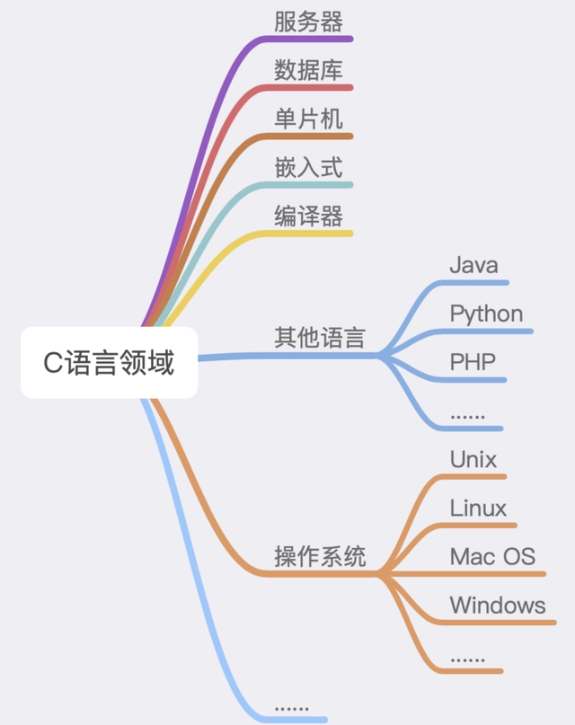
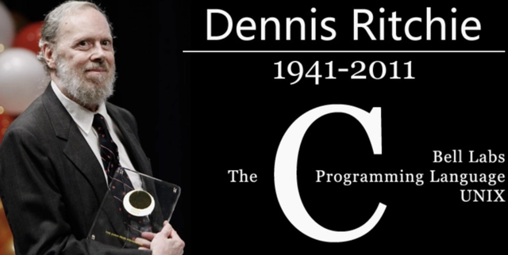

# 编程范式

## 1. C 语言



> 如今这世界上，凡是带电的地方，可能都会有她(C语言)或者她的子孙的影子。
> 
> 任何比C语言更低级的语言，都不足以完整地抽象一个计算机系统；任何比C高级的语言，都可以用C来实现。

C 语言历史悠久，而几乎现在看到的所有编程语言都是以 C 语言为基础来拓展的，不管是 C++、Java、C#、Go、Python、PHP、Perl、JavaScript、Lua，还是 Shell。
C 语言问世 40 多年以来，其影响了太多太多的编程语言，到现在还一直被广泛使用，不得不佩服它的生命力。

### 1.1 C语言之父



C语言之父, 丹尼斯·麦卡利斯泰尔·里奇（英语：Dennis MacAlistair Ritchie，1941年9月9日－2011年10月12日）－2011年10月12日），美国计算机科学家。
黑客圈子通常称他为“dmr”。他是C语言的创造者、Unix操作系统的关键开发者，对计算机领域产生了深远影响，并与肯·汤普逊同为1983年图灵奖得主。

麻省理工大学计算机系的马丁教授评价说："如果说，乔布斯是可视化产品中的国王，那么里奇就是不可见王国中的君主。
乔布斯的贡献在于，他如此了解用户的需求和渴求，以至于创造出了让当代人乐不思蜀的科技产品。
然而，却是里奇先生为这些产品提供了最核心的部件，人们看不到这些部件，却每天都在使用着。"克尼汉评价道：牛顿说他是站在巨人的肩膀上，如今，我们都站在里奇的肩膀上。


### 1.2 C语言的发展


1973年，肯·汤普逊(Ken Thompson)和里奇合作把Unix的90%以上用C语言改写，即Unix第五版。
这是C语言第一次应用在操作系统的核心编写上。随着Unix的日益广泛使用，C语言也迅速得到推广。

随着Unix的发展，C语言也得到了不断地完善。C语言是一门面向过程地、抽象化的编程语言，广泛应用于底层开发。
C语言能用简易的方式编译、处理低级存储器。如此简单，简洁，几乎每个计算机制造商都转向了它，且效果显著。

为了利于C语言的全面推广，很多专家学者和硬件产商联合组成了C语言标准委员会。
于是在1989年，第一个完备的C标准诞生了，简称“C89”，截至目前，最新的C语言标准为2017年发布的“C17”。

C语言开始移植到其他机器上使用。史蒂芬·强生(Stephen C.Johnson)实现了一套“可移植编译器”，这套编译器修改起来相对容易，并且可以为不同的机器生成代码。
从那时起，C语言在大多数计算机上被使用，C语言很规范，即使没有一份正式的标准，也可以写出C程序，这些程序无需修改就可以运行在任何支持C语言的最小运行时环境的计算机上。

1978年以后，C语言先后移植到大，中，小和微型计算机上。C语言便很快风靡全球，成为世界上应用最为广泛的程序设计高级语言。

### 1.3 C语言编译器

C语言编译器普遍存在于各种不同的操作系统中，例如Microsoft Windows、macOS、Linux、Unix等。

C语言编写程序时， 编写的内容都被存储到文本文件中，该文件被成为源代码文件（source code file）。wordCount.c 基本名称+扩展名称

C语言的基本策略是：吧源代码文件转换为可执行文件（包含饥饿直接运行的机器语言代码）。典型的C通过编译和连接两个步骤来完成这一过程。编译器把源代码转换成中间代码，连接器把中间代码和其他代码合并，
生成可执行文件，C 使用这种分而治之的方法方便对程序进行模块化，可以独立编译单独的模块，然后再用连接器合并已经编译的模块，通过这种方式，如果只更改某个模块，不必因此重新编译其他模块。另外连接器还讲你编写的程序和预编译的库代码合并。


Linux 是一个开源，流行，类似宇UNIX的操作系统，使用 GNU提供的GCC公共域C编译器。编译命令类似：

```shell
gcc inform.c
```

> 大家都用C语言或基于C语言的语言来写编译器， 但是我们知道C语言也是一种高级语言， 那第一个C语言编译器是怎样编写的？

Tomphson在BCPL的基础上开发了B语言，Ritchie又在B语言的基础上成功开发出了现在的C语言。

在C语言被用作系统编程语言之前，Tomphson也用过B语言编写过操作系统。可见在C语言实现以前，B语言已经可以投入实用了。
因此第一个C语言编译器的原型完全可能是用B语言或者混合B语言与PDP汇编语言编写的。但是B语言的执行效率比较低，

但是如果全部用汇编语言来编写，不仅开发周期长、维护难度大，更可怕的是失去了高级程序设计语言必需的移植性。


C语言编译器，就是把编程得到的文件，比如.c,.h的文件，进行读取，并对内容进行分析，按照C语言的规则，将其转换成cpu可以执行的二进制文件。
其本质在于对文件的读入，分析，及处理。这些操作，C语言都是可以实现的。 所以用C语言来做C语言的编译器是完全可行的。

所以C语言编译器就采取了一个取巧的办法：

先用汇编语言编写一个C语言的一个子集的编译器，再通过这个子集去递推，进而完成完整的C语言编译器。


那么这种大胆的子集简化的方法，是怎么实现的，又有什么理论依据呢？

#### “自编译”Self-Compile 0生1，1生C，C生万物

先介绍一个概念，“自编译”Self-Compile，也就是对于某些具有明显自举性质的强类型
（所谓强类型就是程序中的每个变量必须声明类型后才能使用，比如C语言，相反有些脚本语言则根本没有类型这一说法） 编程语言，
可以借助它们的一个有限小子集，通过有限次数的递推来实现对它们自身的表述，这样的语言有C、Pascal、Ada等等，至于为什么可以自编译，
可以参见清华大学出版社的《编译原理》，书中实现了一个Pascal的子集的编译器。

例如：
1. 控制循环和分支的都有多种表述方法，其实都可简化成一种，具体的来说，循环语句有while循环，do…while循环和for循环，只需要保留while循环就够了。

2. 分支语句又有if…{}, if…{}…else, if…{}…else if…, switch，这四种形式，它们都可以通过两个以上的if…{}来实现，因此只需要保留if,…{}就够了。

3. 可是再一想，所谓的分支和循环不过是条件跳转语句罢了，函数调用语句也不过是一个压栈和跳转语句罢了，因此只需要goto（未限制的goto）。


### 1.4 C 语言编程范式

> 编程范式的英语是 Programming Paradigm，范即模范之意，范式即模式、方法，是一类典型的编程风格，是指从事软件工程的一类典型的风格（可以对照“方法学”一词）。

无论是传统世界，还是编程世界，我们都在干一件事情，什么事呢？ 那就是通过使用一种更为通用的方式，用另外的话说就是抽象和隔离，让复杂的“世界”变得简单一些。


然而，要做到抽象，对于 C 语言这样的类型语言来说，首先要拿出来讲的就是抽象类型，这就是所谓的泛型编程。类型转换有时候可以让我们编程更方便一些，也让相近的类型可以做到一点点的泛型。

自 C 语言问世 40 多年以来，其影响了太多太多的编程语言，到现在还一直被广泛使用，不得不佩服它的生命力。
但是，我们也要清楚地知道，大多数 C Like 编程语言其实都是在改善 C 语言带来的问题。

那 C 语言有哪些特性呢？

1. C 语言是一个静态弱类型语言，在使用变量时需要声明变量类型，但是类型间可以有隐式转换；
2. 不同的变量类型可以用结构体（struct）组合在一起，以此来声明新的数据类型；
3. C 语言可以用 typedef 关键字来定义类型的别名，以此来达到变量类型的抽象；
4. C 语言是一个有结构化程序设计、具有变量作用域以及递归功能的过程式语言；
5. C 语言传递参数一般是以值传递，也可以传递指针；
6. 通过指针，C 语言可以容易地对内存进行低级控制，然而这加大了编程复杂度；
7. 编译预处理让 C 语言的编译更具有弹性，比如跨平台。

C 语言的这些特性，可以让程序员在微观层面写出非常精细和精确的编程操作，让程序员可以在底层和系统细节上非常自由、灵活和精准地控制代码。

然而，在代码组织和功能编程上，C 语言的上述特性，却不那么美妙了。

我们从 C 语言最简单的交换两个变量的 swap 函数说起，参看下面的代码：

```C
void swap(int* x, int* y)
{
  int tmp = *x;
  *x = *y;
  *y = tmp;
}
```
这里是 C 语言指针，因为如果你不用指针的话，那么参数变成传值，即函数的形参是调用实参的一个拷贝，函数里面对形参的修改无法影响实参的结果。
为了要达到调用完函数后，实参内容的交换，必须要把实参的地址传递进来，也就是传指针。这样在函数里面做交换，实际变量的值也被交换了。

然而，这个函数最大的问题就是它只能给 int 值用，这个世界上还有很多类型包括 double、float，这就是静态语言最糟糕的一个问题

对于 C 语言的类型转换，是会出很多问题的。比如说，传给我一个数组，这个数组本来是 double 型的，或者是 long 型 64 位的，但是如果把数组类型强转成 int，那么就会出现很多问题，因为这会导致程序遍历数组的步长不一样了

比如：一个 double a[10] 的数组，a[2] 意味着 a + sizeof(double) * 2。
如果你把 a 强转成 int，那么 a[2] 就意味着 a + sizeof(int) * 2。
我们知道 sizeof(double) 是 8，而 sizeof(int) 是 4。于是访问到了不同的地址和内存空间，这就导致程序出现严重的问题。

#### 1.4.1 C 语言的泛型

一个泛型的示例 - swap 函数好了，我们再看下，C 语言是如何实现泛型的。

C 语言的类型泛型基本上来说就是使用void *关键字或是使用宏定义。下面是一个使用了void* 泛型版本的 swap 函数。

```shell

void swap(void* x, void* y, size_t size)
{
     char tmp[size];
     memcpy(tmp, y, size);
     memcpy(y, x, size);
     memcpy(x, tmp, size);
}
```
这个实现方式有三个重点：

1. 函数接口中增加了一个size参数。 因为，用了 void* 后，类型被“抽象”掉了，编译器不能通过类型得到类型的尺寸了，所以，需要我们手动地加上一个类型长度的标识。
2. 函数的实现中使用了memcpy()函数。还是因为类型被“抽象”掉了，所以不能用赋值表达式了，很有可能传进来的参数类型还是一个结构体，因此，为了要交换这些复杂类型的值，我们只能使用内存复制的方法了。
3. 函数的实现中使用了一个temp[size]数组。这就是交换数据时需要用的 buffer，用 buffer 来做临时的空间存储。

于是，新增的size参数，使用的 memcpy 内存拷贝以及一个 buffer，这增加了编程的复杂度。这就是 C 语言的类型抽象所带来的复杂度的提升。

这种“泛型”是不是太宽松了一些，完全不做类型检查，就是在内存上对拷，直接操作内存的这种方式，感觉是不是比较危险，而且就像一个定时炸弹一样，不知道什么时候，在什么条件下就爆炸了。

这种泛型，让我们根本没有办法检查传入参数的size，导致我们只能增加接口复杂度，加入一个size参数，然后把这个问题抛给调用者了。

### 1.5 C 语言的问题

如果说，程序 = 算法 + 数据，我觉得 C 语言会有这几个问题

1. 一个通用的算法，需要对所处理的数据的数据类型进行适配。但在适配数据类型的过程中，C 语言只能使用 void* 或 宏替换的方式，这两种方式导致了类型过于宽松，并带来很多其它问题。
2. 适配数据类型，需要 C 语言在泛型中加入一个类型的 size，这是因为我们识别不了被泛型后的数据类型，而 C 语言没有运行时的类型识别，所以，只能将这个工作抛给调用泛型算法的程序员来做了。
3. 算法其实是在操作数据结构，而数据则是放到数据结构中的，所以，真正的泛型除了适配数据类型外，还要适配数据结构，最后这个事情导致泛型算法的复杂急剧上升。比如容器内存的分配和释放，不同的数据体可能有非常不一样的内存分配和释放模型；再比如对象之间的复制，要把它存进来我需要有一个复制，这其中又涉及到是深拷贝，还是浅拷贝。
4. 最后，在实现泛型算法的时候，你会发现自己在纠结哪些东西应该抛给调用者处理，哪些又是可以封装起来。如何平衡和选择，并没有定论，也不好解决。

C 语言设计目标是提供一种能以简易的方式编译、处理底层内存、产生少量的机器码以及不需要任何运行环境支持便能运行的编程语言。C 语言也很适合搭配汇编语言来使用。C 语言把非常底层的控制权交给了程序员

### 1.6 C语言设计理念

1. 相信程序员；
2. 不会阻止程序员做任何底层的事；
3. 保持语言的最小和最简的特性；
4. 保证 C 语言的最快的运行速度，那怕牺牲移值性。
5. 使用 C 语言的程序员在高级语言的特性之上还能简单地做任何底层上的微观控制。

而对于更高阶、更为抽象的编程模型来说，C 语言这种基于过程和底层的初衷设计方式就会成为它的短板。
因为，在编程这个世界中，更多的编程工作是解决业务上的问题，而不是计算机的问题，所以，我们需要更为贴近业务、更为抽象的语言。

那 C 语言会怎么去解决这些问题呢？简单点说，C 语言并没有解决这些问题，所以才有了后面的 C++ 等其他语言。

## 2. C++语言

C++ 可算是一种声名在外的编程语言了。这个名声有好有坏，从好的方面讲，C++ 性能非常好，哪个编程语言性能好的话，总忍不住要跟 C++ 来单挑一下；
从坏的方面讲，它是臭名昭著的复杂、难学、难用。当然，这样一来，熟练的 C++ 程序员也就自然而然获得了“水平很高”的名声，所以这也不完全是件坏事。

多范式，是因为 C++ 支持面向过程编程，也支持面向对象编程，也支持泛型编程，新版本还可以说是支持了函数式编程。
同时，上面这些不同的范式，都可以在同一项目中组合使用，这就大大增加了开发的灵活性。因此，C++ 适用的领域非常广泛，小到嵌入式，大到分布式服务器，到处可以见到 C++ 的身影。

下面是一些著名的用到 C++ 的场合：

1. 大型桌面应用程序（如 Adobe Photoshop、Google Chrome 和 Microsoft Office）
2. 大型网站后台（如 Google 的搜索引擎）
3. 游戏（如 StarCraft）和游戏引擎（如 Unreal 和 Unity）
4. 编译器（如 LLVM/Clang 和 GCC）
5. 解释器（如 Java 虚拟机和 V8 JavaScript 引擎）
6. 实时控制（如战斗机的飞行控制和火星车的自动驾驶系统）
7. 视觉和智能引擎（如 OpenCV、TensorFlow）
8. 数据库（如 Microsoft SQL Server、MySQL 和 MongoDB）

### 2.1 C++ 之父

本贾尼·斯特劳斯特卢普


### 2.2 C++ 语言的发展

### 2.3 C++ 编译器

### 2.4 C++ 语言编程范式

### 2.5 C++ 语言问题

### 2.6 C++ 语言设计理念


